<p align="center">
  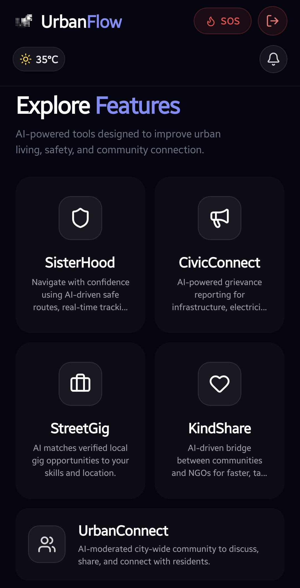
</p>

<h1 align="center">UrbanFlow</h1>
<h3 align="center">The Integrated AI-Powered Civic Management Suite</h3>

<p align="center">
  <strong>SANKALP Hackathon 2026</strong><br>
  Built by <strong>· Shreyansh Sachan</strong> · <strong>Ishwar</strong> · <strong>Aryan Gupta</strong> · <strong>Arushi Nayak</strong>
</p>

<p align="center">
  
  
  
  
</p>

---

> **UrbanFlow** is a production-grade, AI-first civic Intelligent system that transforms the relationship between citizens, municipal administration, local leaders, and field operations. It deploys a synchronized, three-tier ecosystem driven by **Large Language Models**, **multi-agent AI orchestration**, **real-time streaming**, **computer vision**, **satellite analytics**, and **geospatial intelligence**.

---

## System Workflow — End-to-End Architecture

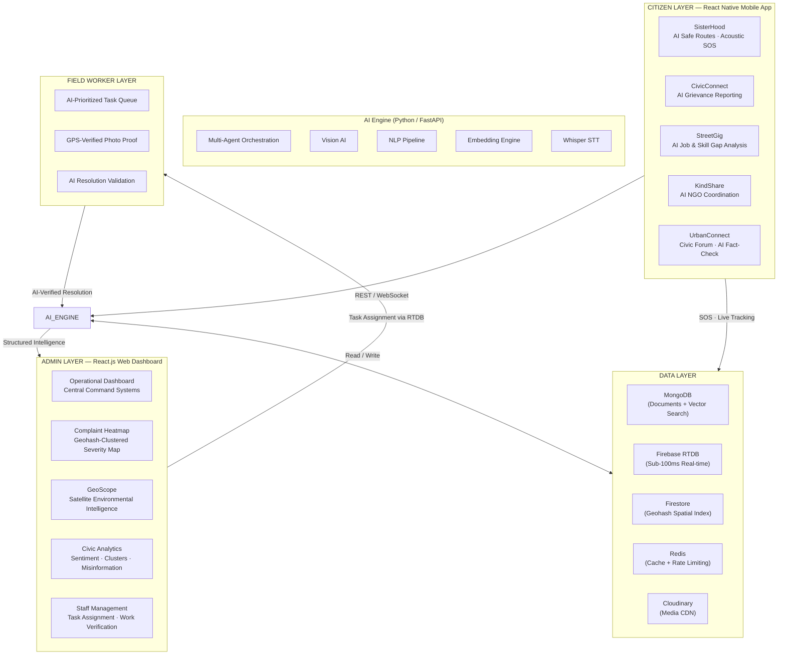
```mermaid
graph TB
    subgraph CITIZENS["CITIZEN LAYER — React Native Mobile App"]
        C1["SisterHood<br/>AI Safe Routes · Acoustic SOS"]
        C2["CivicConnect<br/>AI Grievance Reporting"]
        C3["StreetGig<br/>AI Job & Skill Gap Analysis"]
        C4["KindShare<br/>AI NGO Coordination"]
        C5["UrbanConnect<br/>Civic Forum · AI Fact-Check"]
    end

    subgraph AI["AI Engine (Python / FastAPI)"]
        direction TB
        A1[Multi-Agent Orchestration]
        A2[Vision AI]
        A3[NLP Pipeline]
        A4[Embedding Engine]
        A5[Whisper STT]
    end

    subgraph ADMIN["ADMIN LAYER — React.js Web Dashboard"]
        AD1["Operational Dashboard<br/>Central Command Systems"]
        AD2["Complaint Heatmap<br/>Geohash-Clustered Severity Map"]
        AD3["GeoScope<br/>Satellite Environmental Intelligence"]
        AD4["Civic Analytics<br/>Sentiment · Clusters · Misinformation"]
        AD5["Staff Management<br/>Task Assignment · Work Verification"]
    end

    subgraph DATA["DATA LAYER"]
        D1["MongoDB<br/>(Documents + Vector Search)"]
        D2["Firebase RTDB<br/>(Sub-100ms Real-time)"]
        D3["Firestore<br/>(Geohash Spatial Index)"]
        D4["Redis<br/>(Cache + Rate Limiting)"]
        D5["Cloudinary<br/>(Media CDN)"]
    end

    subgraph FIELD["FIELD WORKER LAYER"]
        F1["AI-Prioritized Task Queue"]
        F2["GPS-Verified Photo Proof"]
        F3["AI Resolution Validation"]
    end

    CITIZENS -->|"REST / WebSocket"| AI_ENGINE
    AI_ENGINE -->|"Structured Intelligence"| ADMIN
    ADMIN -->|"Task Assignment via RTDB"| FIELD
    FIELD -->|"AI-Verified Resolution"| AI_ENGINE
    AI_ENGINE <-->|"Read / Write"| DATA
    CITIZENS -->|"SOS · Live Tracking"| DATA
```

---

## Problem Statements Addressed

Citizens lack unified, intelligent channels for reporting grievances, accessing safe navigation, finding employment, and coordinating community resources. Municipal systems operate in silos with no AI layer to triage, route, or verify work — resulting in slow response, low transparency, and poor outcomes.

### AI for Local Leadership, Decision Intelligence & Public Trust
Local leaders operate at the front line of service delivery, yet grassroots governance processes remain fragmented and unstructured. UrbanFlow's **Civic Intelligence Dashboard** directly addresses this with:

The challenge is to design an AI-powered leadership and decision-support system that helps local leaders understand ground realities, prioritize effectively, execute efficiently, and communicate transparently using both on-ground data and digital public signals.

---

## Application Walkthrough

### Citizen Mobile Application

The mobile interface is designed for accessibility and rapid response, enabling citizens to interact with AI-powered civic tools from a single unified surface.

<p align="center">
  
  &nbsp;&nbsp;
  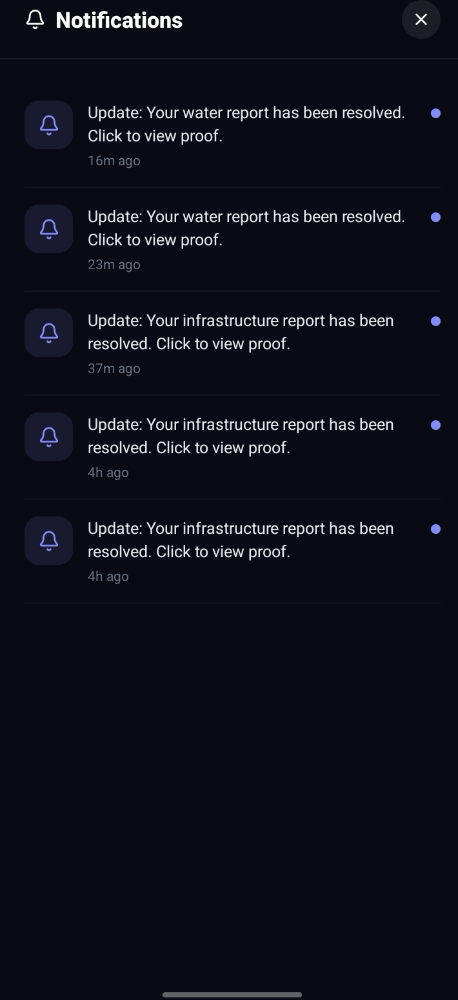
</p>
<p align="center">
  <em>Left: Dashboard Home with feature cards (SisterHood, CivicConnect, StreetGig, KindShare, UrbanConnect) · Right: Real-time notification feed showing grievance resolution updates</em>
</p>

---

### Web Administration Panel
A centralized AI command hub leveraging satellite telemetry and advanced AI to monitor, analyze, and orchestrate city operations at scale.

<p align="center">
  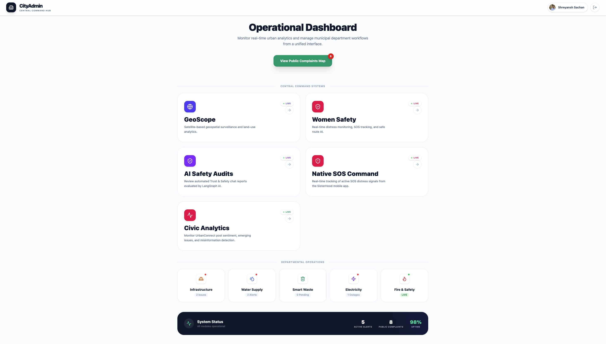
</p>
<p align="center">
  <em>Operational Dashboard — Central Command Systems with live status indicators and Departmental Operations overview</em>
</p>

<p align="center">
  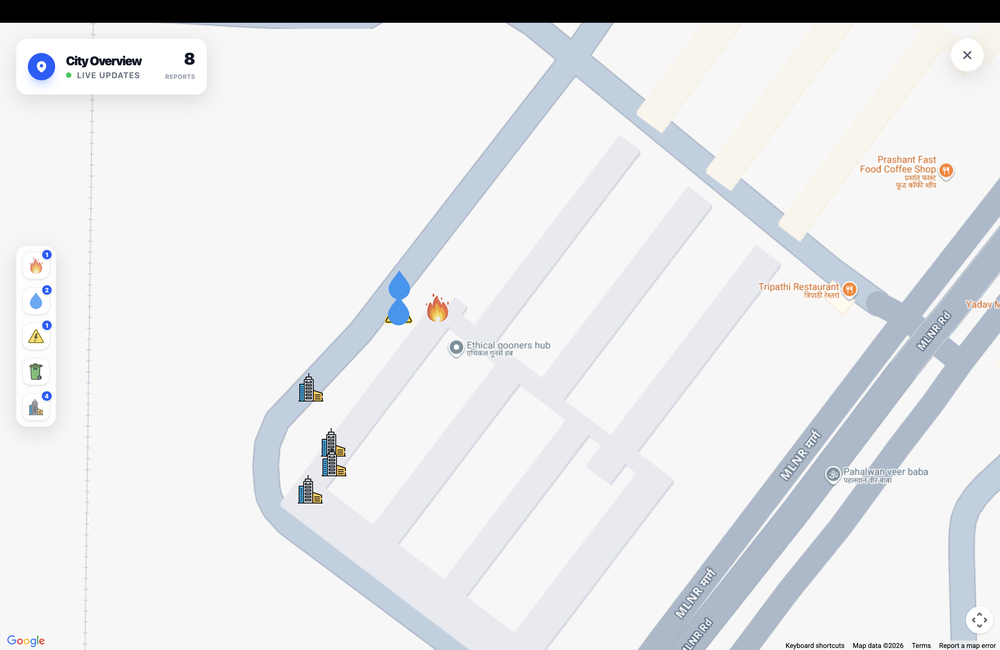
</p>
<p align="center">
  <em>Live Complaint Heatmap — Geohash-clustered grievances with AI-determined severity, filterable by department and date range</em>
</p>

---

### GeoScope — Satellite Intelligence Panel
A planetary-scale monitoring suite that leverages Google Earth Engine and satellite telemetry to penetrate cloud cover, map environmental crises, and audit urban health through thermal benchmarking.

<p align="center">
  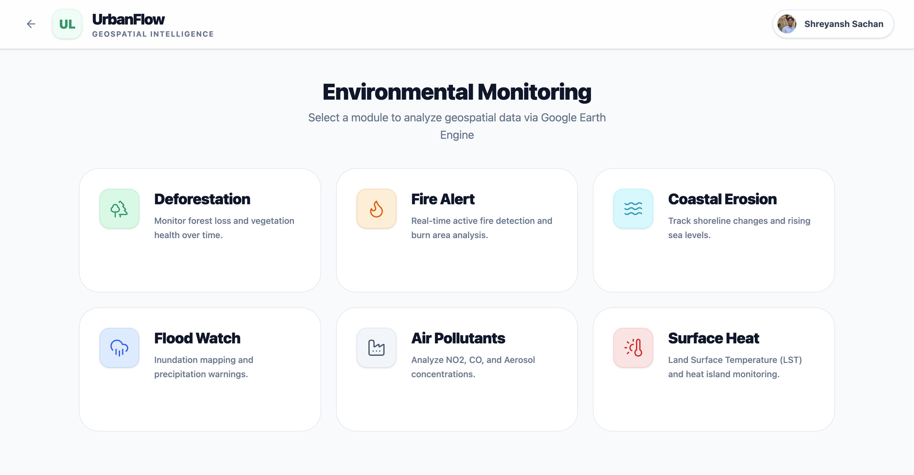
  &nbsp;
  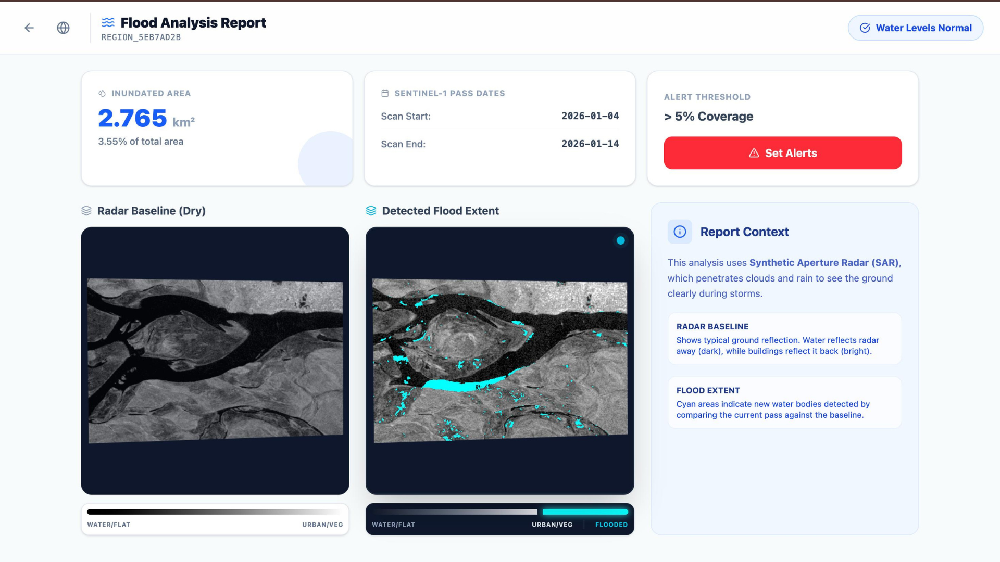
</p>
<p align="center">
  <em>Left: Environmental Monitoring module selector (6 analysis types powered by Google Earth Engine) · Right: Flood Analysis Report using Sentinel-1 SAR data with radar baseline vs. detected flood extent</em>
</p>

---

### UrbanConnect Intelligence Dashboard — AI Leadership Module

A strategic AI intelligence surface that distills community signals into actionable insights, identifying emerging issue clusters and safeguarding public discourse through automated misinformation detection.

<p align="center">
  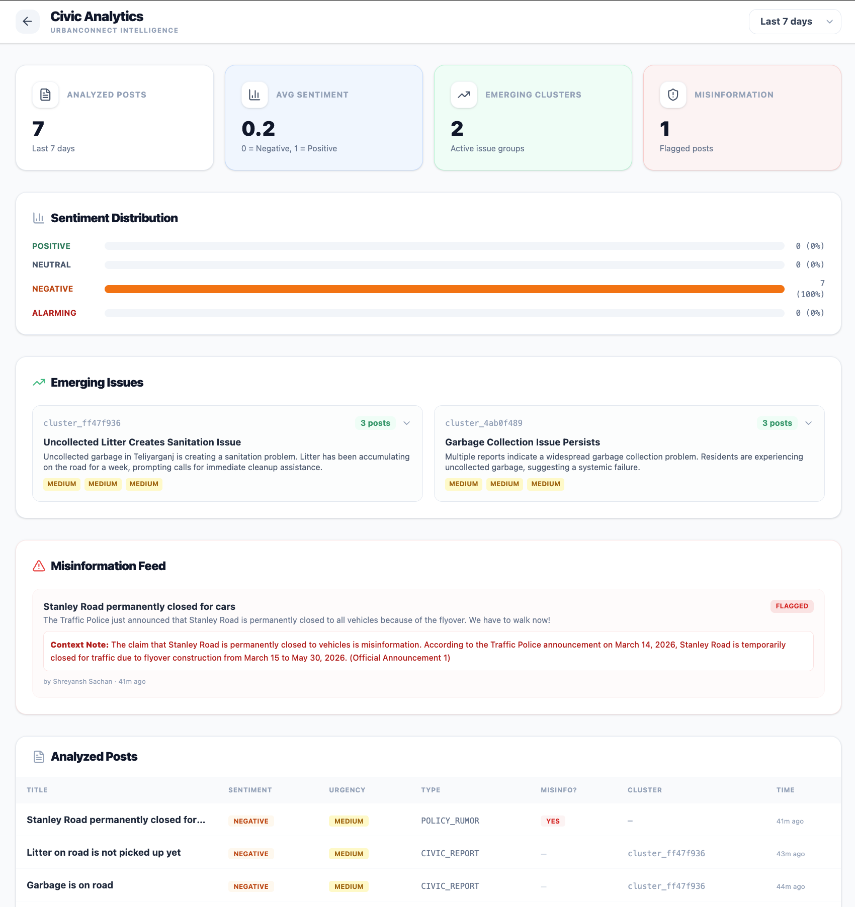
</p>
<p align="center">
  <em>Civic Analytics — Real-time sentiment distribution, emerging issue clusters, misinformation detection with AI-generated context notes, and a per-post analysis table</em>
</p>

---

### Staff & Field Worker Management

A proximity-aware command system that auto-dispatches the nearest staff via intelligent timers and uses AI-powered visual comparison to audit and verify resolution integrity.

<p align="center">
  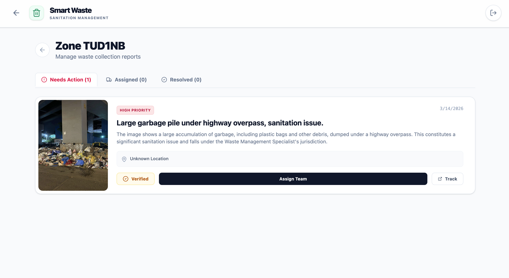
  &nbsp;
  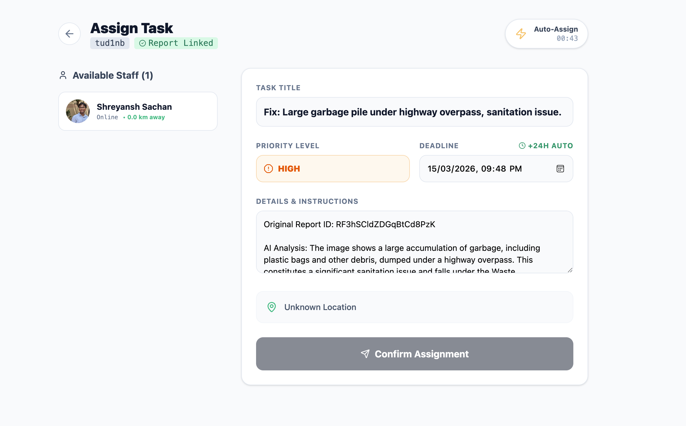
  &nbsp;
  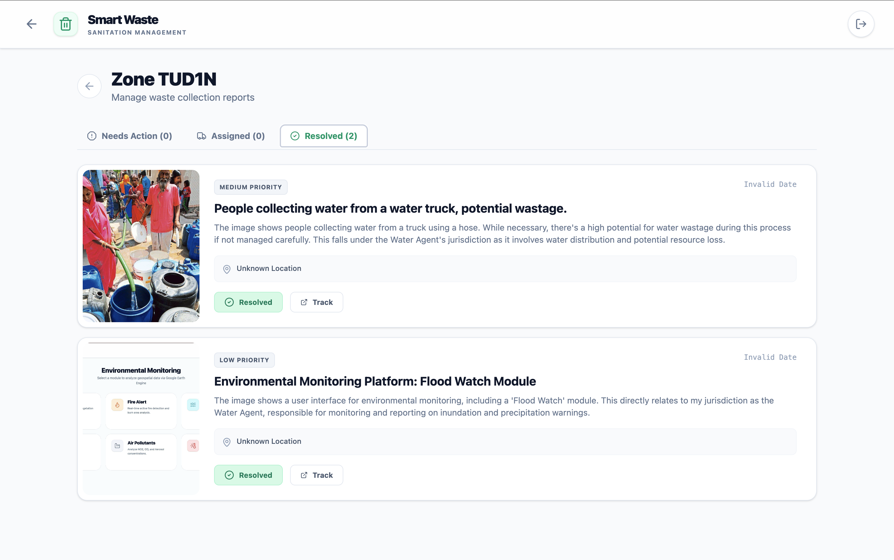
</p>
<p align="center">
  <em>Left: AI-triaged complaint queue (Needs Action) · Center: Staff assignment panel with proximity ranking and AI-generated task details · Right: Resolved complaints with AI verification</em>
</p>

<p align="center">
  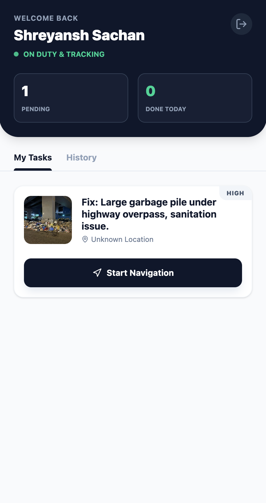
</p>
<p align="center">
  <em>Staff Work Overview — Track assigned, in-progress, and completed tasks across all field workers</em>
</p>

---

### Women Safety — Police Command Panel

A high-stakes emergency interface that synchronizes live SOS tracking with AI-driven voice intelligence to transcribe distress, detect recurring safety patterns, and generate immediate response playbooks.

<p align="center">
  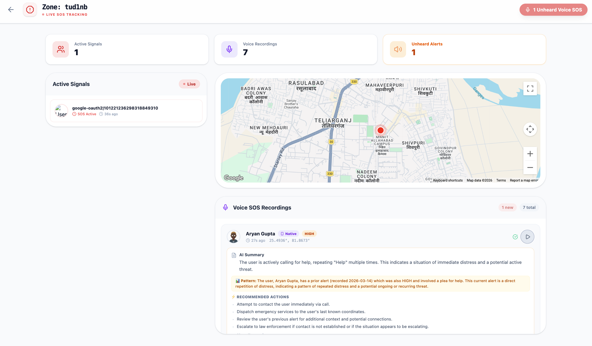
</p>
<p align="center">
  <em>Live SOS Command — Active distress signals on map, Voice SOS recordings with AI-generated summaries, distress pattern detection, and recommended emergency actions</em>
</p>

---

## Detailed Feature Breakdown

### 1. SisterHood — AI-Powered Personal Safety & Emergency Response

SisterHood is a real-time safety platform built on continuous AI inference and decentralized emergency coordination, primarily targeting women navigating urban environments.

<p align="center">
  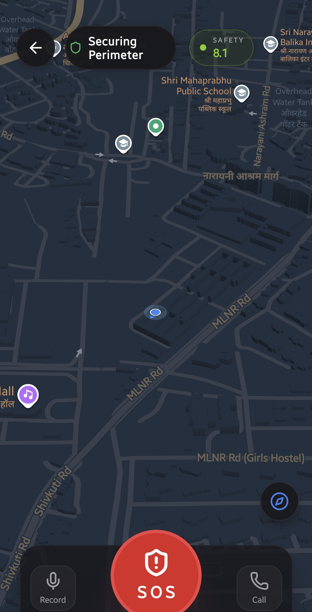
  &nbsp;&nbsp;
  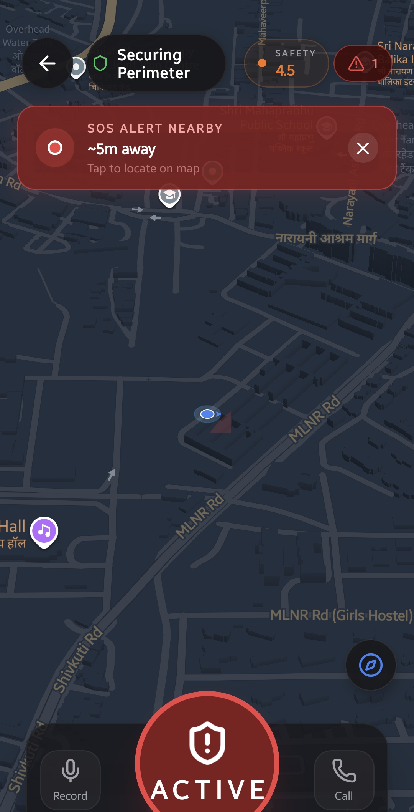
  &nbsp;&nbsp;
  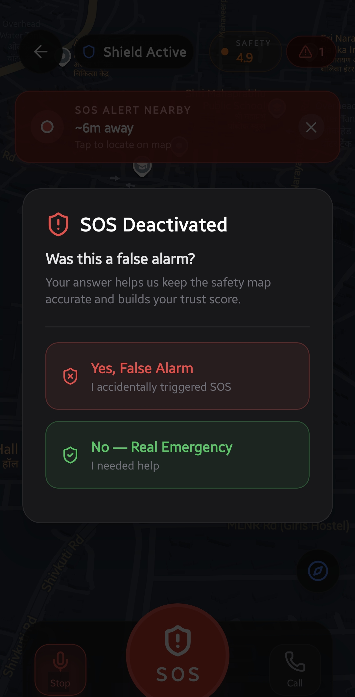
</p>
<p align="center">
  <em>Left: AI safe route with risk heatmap · Center: SOS triggered — Securing Perimeter with nearby alert broadcast · Right: SOS deactivation with false alarm feedback loop</em>
</p>

#### Architectural Workflow

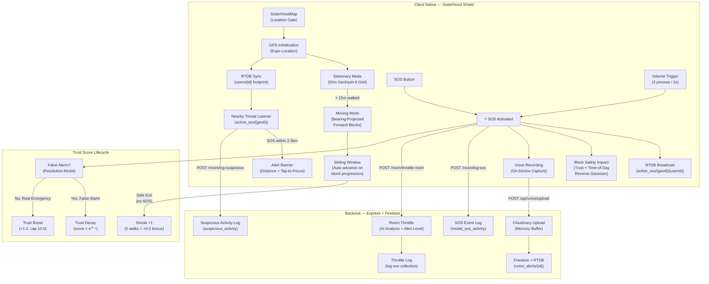
```mermaid
graph TD
    subgraph NATIVE[" Client Native — SisterHood Shield"]
        A[" SisterHoodMap\n(Location Gate)"] --> B[" GPS Initialization\n(Expo Location)"]
        B --> C[" Stationary Mode\n(50m Geohash-8 Grid)"]
        C -->|"> 15m walked"| D[" Moving Mode\n(Bearing-Projected\nForward Blocks)"]
        D --> E[" Sliding Window\n(Auto-advance on\nblock progression)"]

        B --> F[" RTDB Sync\n(users/{id} footprint)"]
        F --> G["Nearby Threat Listener\n(active_sos/{geo6})"]
        G -->|"SOS within 2.5km"| H[" Alert Banner\n(Distance + Tap-to-Focus)"]

        I[" SOS Button"] --> J["⚡ SOS Activated"]
        K[" Volume Trigger\n(3 presses / 2s)"] --> J

        J --> L[" RTDB Broadcast\n(active_sos/{geo6}/{userId})"]
        J --> M[" Block Safety Impact\n(Trust × Time-of-Day\nReverse Gaussian)"]
        J --> N[" Voice Recording\n(On-Device Capture)"]
    end

    subgraph BACKEND[" Backend — Express + Firebase"]
        N -->|"POST /api/voice/upload"| O[" Cloudinary Upload\n(Memory Buffer)"]
        O --> P[" Firestore + RTDB\n(voice_alerts/{id})"]

        J -->|"POST /room/log-sos"| R[" SOS Event Log\n(model_sos_activity)"]

        G -->|"POST /room/log-suspicious"| S[" Suspicious Activity Log\n(suspicious_activity)"]

        J -->|"POST /room/throttle-room"| T[" Room Throttle\n(AI Analysis + Alert Level)"]
        T --> U[" Throttle Log\n(log-sos collection)"]
    end

    subgraph TRUST[" Trust Score Lifecycle"]
        J --> AA[" False Alarm?\n(Resolution Modal)"]
        AA -->|"Yes, False Alarm"| AB[" Trust Decay\n(score × e⁻⁰·⁴)"]
        AA -->|"No, Real Emergency"| AC[" Trust Boost\n(+1.0, cap 10.0)"]
        E -->|"Safe Exit\n(no SOS)"| AD[" Streak +1\n(5 walks = +0.5 bonus)"]
    end

```

#### Technical Deep-Dive

| Component | Technology | Implementation |
|---|---|---|
| **Geospatial Sliding Window** | Geohash-8, Firebase RTDB | Predictive path-aware tracking that initializes a 50m stationary perimeter grid and transitions to bearing-projected forward blocks upon movement detection, autonomously sliding the monitoring window in real time. |
| **Hardware SOS Trigger** | Volume Manager, Haptics | Zero-interaction emergency activation — 3 hardware volume-button presses within a 2-second window triggers full SOS protocol with immediate haptic confirmation. |
| **Voice SOS Recording** | Cloudinary, Firebase RTDB | On-device audio capture during active distress, uploaded to Cloudinary and mirrored to RTDB for real-time admin playback with AI-generated transcription, urgency classification, and cross-alert pattern memory. |
| **Trust Score Engine** | Reverse Gaussian Decay | Behavioral credibility model: exponential decay penalty (`e^(−0.4)`) for false alarms, `+1.0` boost for verified emergencies. Safe-walk streaks reward consistent users (+0.5 after 5 walks). Verified ceiling: 10.0, unverified: 7.5. |
| **Block Safety Heatmap** | Time-Aware Reverse Gaussian | Every geohash-8 block maintains a live safety score (1–10). SOS events apply trust-weighted impact scaled by a time-of-day multiplier (nighttime × 1.5, daytime × 0.7), with natural decay over a 70-hour half-life. |
| **Emergency Network** | Firebase RTDB, Background Service | Parallel SOS broadcast to `active_sos/{geo6}` alerting all users within a 2.5 km radius, with full persistence via a background service that continues tracking even when the app is minimized or killed. |
| **Voice Analysis Pipeline** | Cloudinary → Firestore → RTDB → AI Agent | End-to-end pipeline: audio secured in Cloudinary, metadata dual-written to Firestore and RTDB, then a fire-and-forget trigger dispatches the AI voice analysis agent for transcription, urgency scoring, and historical pattern detection. |

---

### 2. CivicConnect (EcoSnap) — AI-Triaged Unified Grievance Reporting

CivicConnect replaces siloed municipal complaints with a fully AI-automated pipeline covering waste management, electricity faults, water supply, road infrastructure, and fire safety.

<p align="center">
  
  &nbsp;&nbsp;
  
  &nbsp;&nbsp;
  
  &nbsp;&nbsp;
  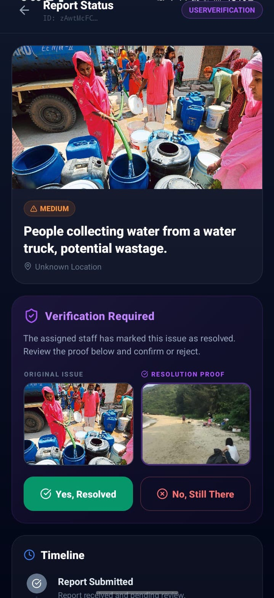
</p>
<p align="center">
  <em>Left to Right: AI Grievance Report Submission · AI Photo Verification · Resolution Timeline · Field Worker Resolution Proof Upload</em>
</p>

#### AI Pipeline Architecture

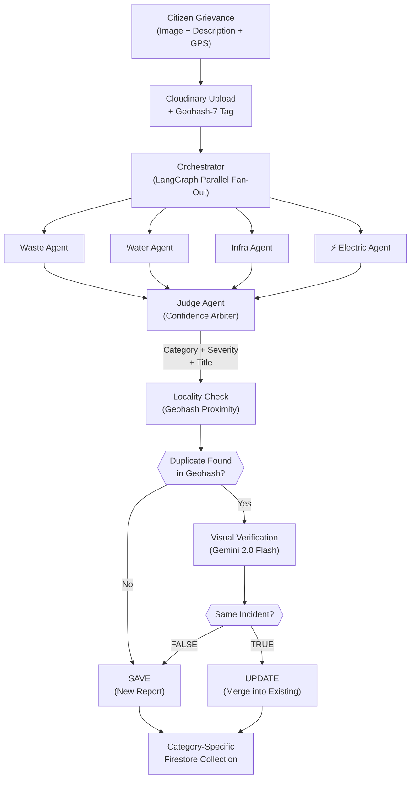
```mermaid
graph TD
    A["Citizen Grievance\n(Image + Description + GPS)"] --> B[" Cloudinary Upload\n+ Geohash-7 Tag"]
    B --> C[" Orchestrator\n(LangGraph Parallel Fan-Out)"]
    
    C --> D[" Waste Agent"]
    C --> E[" Water Agent"]
    C --> F[" Infra Agent"]
    C --> G["⚡ Electric Agent"]
    
    D --> H[" Judge Agent\n(Confidence Arbiter)"]
    E --> H
    F --> H
    G --> H

    H -->|"Category + Severity\n+ Title"| I[" Locality Check\n(Geohash Proximity)"]
    
    I --> J{{"Duplicate Found\nin Geohash?"}}
    J -->|Yes| K["Visual Verification\n(Gemini 2.0 Flash)"]
    J -->|No| L[" SAVE\n(New Report)"]
    
    K --> M{{"Same Incident?"}}
    M -->|TRUE| N[" UPDATE\n(Merge into Existing)"]
    M -->|FALSE| L

    L --> O[" Category-Specific\nFirestore Collection"]
    N --> O

```
### Technical Deep-Dive

| Component | Technology | Implementation |
|:---|:---|:---|
| **Parallel Domain Analysis** | LangGraph, Gemini 2.0 Flash | Specialist agents (Waste, Water, Infra, Electric) execute **parallel multimodality analysis** on grievance data. Each operates with strict jurisdictional prompts to prevent misclassification (e.g., structural road damage vs. loose debris). |
| **Confidence Arbiter (Judge)** | Gemini 2.0 Flash, Structured Output | A "City Operations Supervisor" node reconciles parallel agent findings. It evaluates confidence scores, resolves overlaps (e.g., trash-clogged drains), and selects the winning category and severity level (LOW–CRITICAL). |
| **Geospatial Duplicate Detection** | Geohash-7, Firestore | Before persistence, the system queries category-specific backend endpoints using **Geohash-7 proximity** to identify existing reports within a ~150m radius, preventing redundant municipal tickets. |
| **Visual Duplicate Verification** | Gemini 2.0 Flash (Vision) | If a geohash match is found, Gemini performs **visual cross-verification** between the new submission and the existing record. `TRUE` triggers a report update/refresh; `FALSE` creates a unique new entry. |
| **Category-Routed Storage** | Express API, Firestore | Verified grievances are auto-routed to department-specific collections (`waterReports`, `wasteReports`, etc.) for direct municipal action. Updates are merged via specialized `update*` endpoints. |
| **Native Grievance Portal** | React Native, Expo, Cloudinary | A high-performance mobile interface with location gating, **Geohash-7 auto-tagging**, and Cloudinary-backed evidence hosting. Supports real-time tracking via a status lifecycle: INITIATED → ASSIGNED → RESOLVED → VERIFIED. |
---

### 3. GeoScope — AI-Augmented Satellite Environmental Intelligence

GeoScope is a macro-scale environmental monitoring system built on **Google Earth Engine's** petabyte-scale satellite data infrastructure, extended with custom AI inference pipelines.

<p align="center">
  
  &nbsp;
  
</p>
<p align="center">
  <em>Left: 6-module environmental analysis suite · Right: Live Flood Analysis using Synthetic Aperture Radar (Sentinel-1)</em>
</p>

#### Architectural Workflow

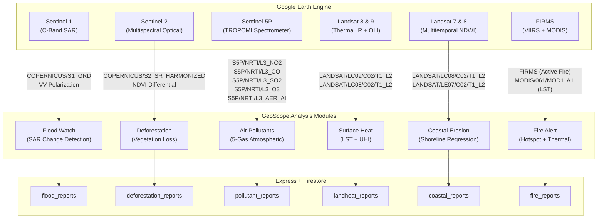
```mermaid
  graph TD
    subgraph GEE[" Google Earth Engine"]
        S1[" Sentinel-1\n(C-Band SAR)"]
        S2[" Sentinel-2\n(Multispectral Optical)"]
        S5P[" Sentinel-5P\n(TROPOMI Spectrometer)"]
        L89[" Landsat 8 & 9\n(Thermal IR + OLI)"]
        L78[" Landsat 7 & 8\n(Multitemporal NDWI)"]
        FIRMS[" FIRMS\n(VIIRS + MODIS)"]
    end

    subgraph MODULES[" GeoScope Analysis Modules"]
        S1 -->|"COPERNICUS/S1_GRD\nVV Polarization"| FL[" Flood Watch\n(SAR Change Detection)"]
        S2 -->|"COPERNICUS/S2_SR_HARMONIZED\nNDVI Differential"| DF["Deforestation\n(Vegetation Loss)"]
        S5P -->|"S5P/NRTI/L3_NO2\nS5P/NRTI/L3_CO\nS5P/NRTI/L3_SO2\nS5P/NRTI/L3_O3\nS5P/NRTI/L3_AER_AI"| AQ[" Air Pollutants\n(5-Gas Atmospheric)"]
        L89 -->|"LANDSAT/LC09/C02/T1_L2\nLANDSAT/LC08/C02/T1_L2"| SH[" Surface Heat\n(LST + UHI)"]
        L78 -->|"LANDSAT/LC08/C02/T1_L2\nLANDSAT/LE07/C02/T1_L2"| CE[" Coastal Erosion\n(Shoreline Regression)"]
        FIRMS -->|"FIRMS (Active Fire)\nMODIS/061/MOD11A1 (LST)"| FA[" Fire Alert\n(Hotspot + Thermal)"]
    end

    subgraph BACKEND[" Express + Firestore"]
        FL --> DB1[" flood_reports"]
        DF --> DB2[" deforestation_reports"]
        AQ --> DB3[" pollutant_reports"]
        SH --> DB4[" landheat_reports"]
        CE --> DB5[" coastal_reports"]
        FA --> DB6[" fire_reports"]
    end

```
### Technical Deep-Dive

| Module | Primary Satellite | Secondary Satellite | Processing |
|:---|:---|:---|:---|
| **Flood Watch** | Sentinel-1 (C-Band SAR) | — | Multi-temporal SAR change detection on `COPERNICUS/S1_GRD` VV polarization. Cloud-penetrating radar compares baseline dry-period imagery against recent acquisitions to map surface water expansion at pixel-level precision. |
| **Deforestation** | Sentinel-2 (Multispectral) | — | Computes NDVI differential on `COPERNICUS/S2_SR_HARMONIZED` between a configurable baseline window (default 90 days) and current acquisitions. Detects localized vegetation loss events between satellite revisit cycles. |
| **Air Pollutants** | Sentinel-5P (TROPOMI) | — | Queries 5 independent atmospheric collections (`L3_NO2`, `L3_CO`, `L3_SO2`, `L3_O3`, `L3_AER_AI`) from `COPERNICUS/S5P/NRTI`. Generates interpolated pollution density maps with configurable threshold alerts per gas species. |
| **Surface Heat (UHI)** | Landsat 9 | Landsat 8 | Cascading sensor fallback: queries `LANDSAT/LC09` first, falls back to `LANDSAT/LC08` if insufficient coverage. Applies Split-Window Algorithm for Land Surface Temperature derivation. Historical `MODIS/061/MOD11A1` LST baseline enables urban heat island anomaly detection. |
| **Fire Alert** | FIRMS (VIIRS) | MODIS/061/MOD11A1 | Active hotspot detection from the `FIRMS` near-real-time collection. Cross-references against `MODIS/061/MOD11A1` historical Land Surface Temperature for thermal baseline context and fire intensity classification. |
| **Coastal Erosion** | Landsat 8 | Landsat 7 | Multi-decadal shoreline regression analysis comparing historic imagery (`LANDSAT/LE07`, default year 2000) against current `LANDSAT/LC08` acquisitions. NDWI water masking tracks coastline shift over time. |

---

### 4. StreetGig — AI-Matched Micro-Employment Exchange

StreetGig is a hyperlocal AI-powered labor marketplace that connects daily wage workers, freelancers, and gig workers with immediate community needs using intelligent matching and skill intelligence.

<p align="center">
  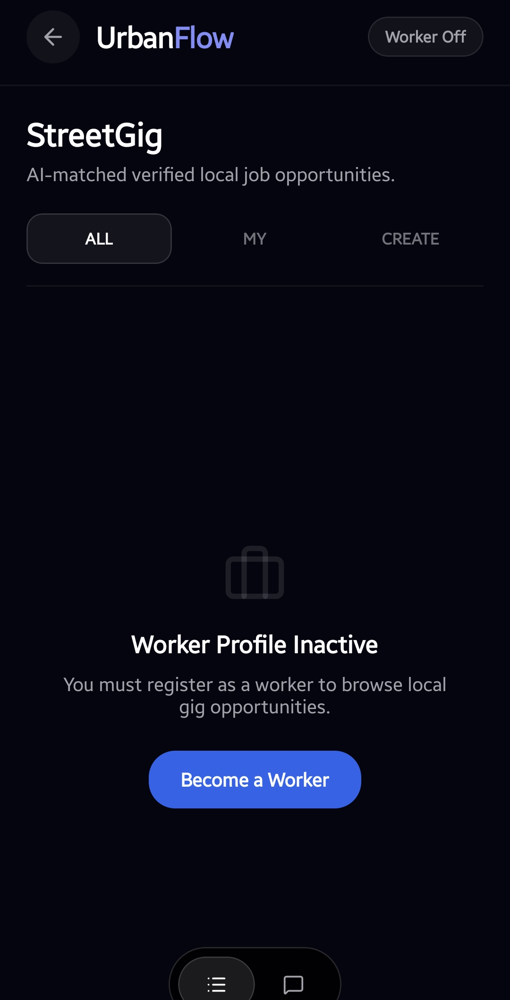
  &nbsp;&nbsp;
  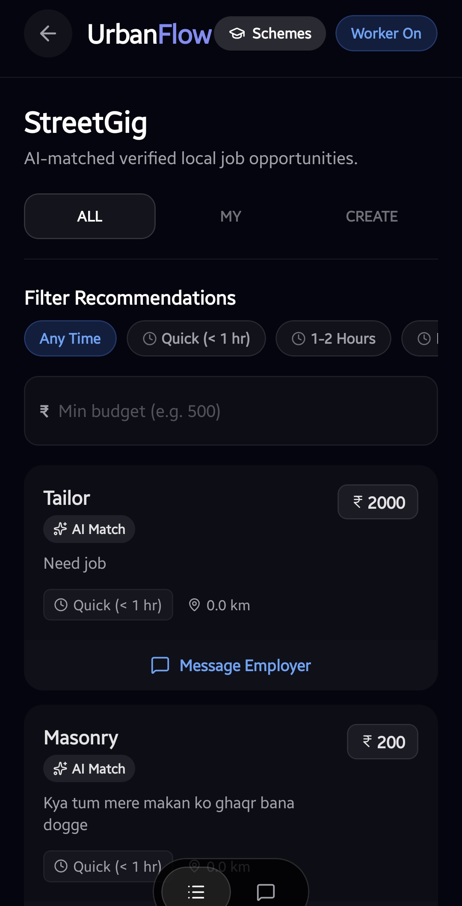
  &nbsp;&nbsp;
  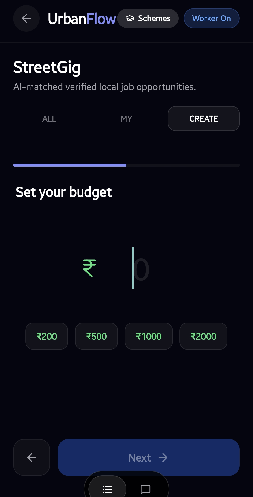
  &nbsp;&nbsp;
  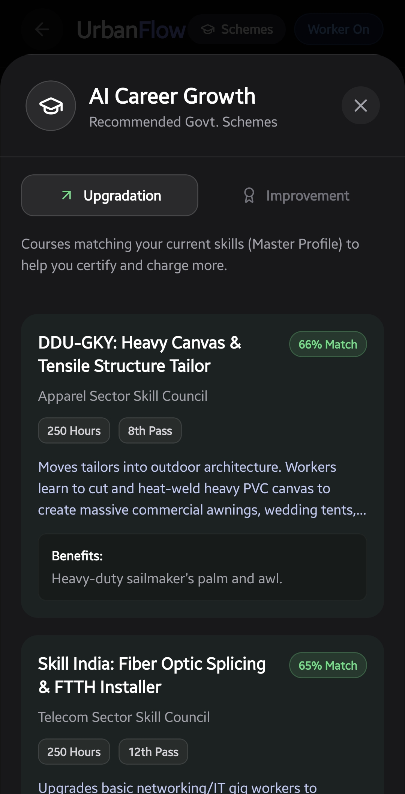
</p>
<p align="center">
  <em>Left to Right: Worker Registration Gate · AI Job Recommendations · Job Creation with Budget Setting · AI Career Growth with Govt. Scheme Matching</em>
</p>

#### AI Matching Architecture

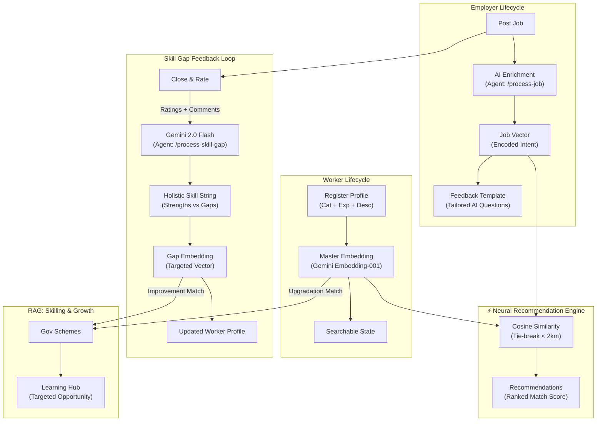
```mermaid
graph TD
    subgraph WORKER[" Worker Lifecycle"]
        W1[" Register Profile\n(Cat + Exp + Desc)"] --> W2[" Master Embedding\n(Gemini Embedding-001)"]
        W2 --> W3[" Searchable State"]
    end

    subgraph JOB[" Employer Lifecycle"]
        J1[" Post Job"] --> J2[" AI Enrichment\n(Agent: /process-job)"]
        J2 --> J3[" Job Vector\n(Encoded Intent)"]
        J3 --> J4[" Feedback Template\n(Tailored AI Questions)"]
    end

    subgraph MATCH["⚡ Neural Recommendation Engine"]
        W2 & J3 --> M1[" Cosine Similarity\n(Tie-break < 2km)"]
        M1 --> M2[" Recommendations\n(Ranked Match Score)"]
    end

    subgraph GAP[" Skill Gap Feedback Loop"]
        J1 --> CL[" Close & Rate"]
        CL -->|"Ratings + Comments"| G1[" Gemini 2.0 Flash\n(Agent: /process-skill-gap)"]
        G1 --> G2["Holistic Skill String\n(Strengths vs Gaps)"]
        G2 --> G3[" Gap Embedding\n(Targeted Vector)"]
        G3 --> W_PROFILE[" Updated Worker Profile"]
    end

    subgraph RAG[" RAG: Skilling & Growth"]
        W2 -->|"Upgradation Match"| R1[" Gov Schemes"]
        G3 -->|"Improvement Match"| R1
        R1 --> R2[" Learning Hub\n(Targeted Opportunity)"]
    end

```

### Technical Deep-Dive

| System | Technology | Implementation |
|:---|:---|:---|
| **Multimodal Skill Synthesis** | Gemini 2.0 Flash, LangGraph | When a job closes, the `skill_gap_agent` consumes heterogeneous feedback (3x star ratings + 1x textual comment). It performs a **Joint Vision-Language Evaluation** to synthesize a cohesive paragraph documenting verified strengths and critical skill gaps. |
| **Dual-Vector Profiling** | Gemini Embedding-001 (768-dim) | Workers maintain two high-dimensional vectors: 1) **Master Profile** (Static: capabilities) and 2) **Skill Gap** (Dynamic: areas for improvement). This allows the system to differentiate between what a worker *can do* vs what they *need to learn*. |
| **AI Recommendation Logic** | Cosine Similarity, Haversine | Uses a hybrid ranking algorithm. Primary sort is physical distance via Haversine. If distance delta is `< 2km`, the system pulls the `similarityScore` (0.0–1.0) between the worker and job vectors to break the tie, ensuring the "best match" is always on top. |
| **RAG Skilling Engine** | Vector Retrieval (Firestore) | The `/learning-schemes` endpoint acts as a RAG retriever. It compares the worker's **Gap Vector** against the `gov_schemes` vector database. This ensures skilling recommendations are not generic but are mathematically targeted to fix the specific weaknesses identified by past employers. |
| **Background Orchestration** | Fire-and-Forget (Axios) | AI processing for job enrichment and skill gap analysis is handled as non-blocking background tasks. Employers receive immediate 200 OK responses while Python agents process the intelligence loop, preventing UI latency for low-bandwidth users. |
| **Integrated Safety** | Gemini 1.5 Flash (Safety Agent) | Every chat room and job description passes through an `analyze-safety` node. If the LLM detects predatory behavior, wage theft signals, or harassment, the status is automatically flagged to `REVIEW_REQUIRED` with a severity index (LOW–CRITICAL). |

---

### 5. KindShare — AI-Coordinated Resource Redistribution

KindShare is a hyper-local logistics intelligence system that uses AI to eliminate resource waste and accelerate the delivery of essential goods to vulnerable populations.

<p align="center">
  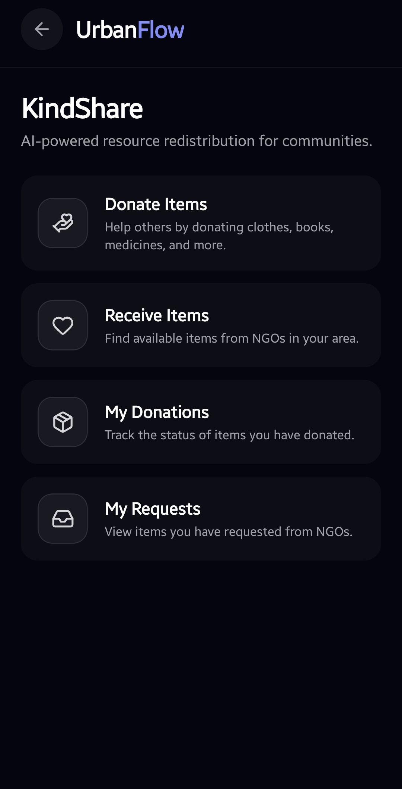
  &nbsp;&nbsp;
  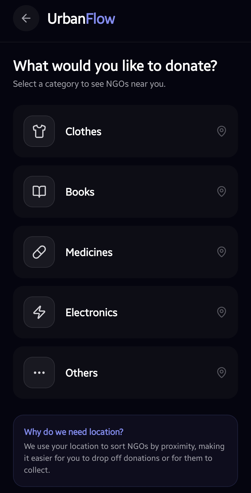
  &nbsp;&nbsp;
  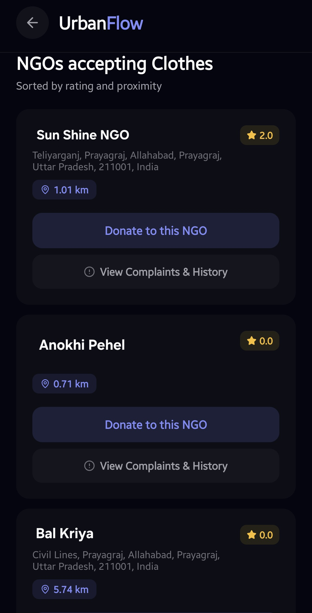
  &nbsp;&nbsp;
  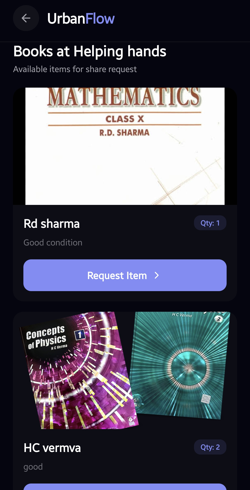
</p>
<p align="center">
  <em>Left to Right: KindShare Home · Donation Category Selector · NGO List (sorted by proximity & rating) · Available Items at NGO</em>
</p>

<p align="center">
  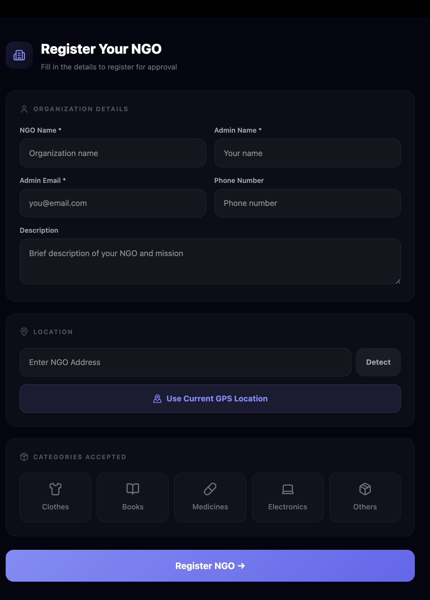
</p>
<p align="center">
  <em>Web Portal — NGO Registration with auto-location detection and category preference selection</em>
</p>

### KindShare: Community Resource Exchange Workflow
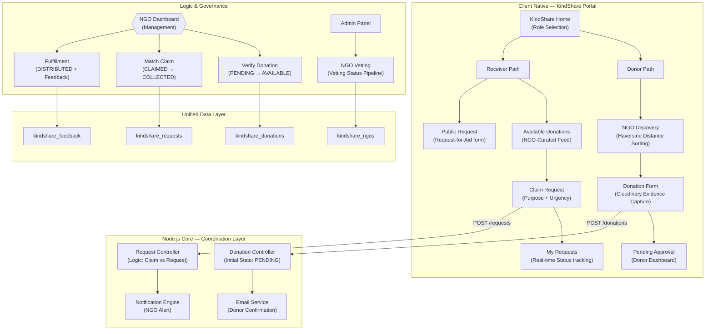
```mermaid
  graph TD
    subgraph APP[" Client Native — KindShare Portal"]
        A[" KindShare Home\n(Role Selection)"] --> B1[" Donor Path"]
        A --> B2[" Receiver Path"]

        B1 --> C1[" NGO Discovery\n(Haversine Distance Sorting)"]
        C1 --> D1[" Donation Form\n(Cloudinary Evidence Capture)"]
        D1 --> E1[" Pending Approval\n(Donor Dashboard)"]

        B2 --> C2[" Available Donations\n(NGO-Curated Feed)"]
        C2 --> D2[" Claim Request\n(Purpose + Urgency)"]
        D2 --> E2[" My Requests\n(Real-time Status tracking)"]
        
        B2 --> F2[" Public Request\n(Request-for-Aid form)"]
    end

    subgraph SERVER[" Node.js Core — Coordination Layer"]
        D1 -->|"POST /donations"| G[" Donation Controller\n(Initial State: PENDING)"]
        D2 -->|"POST /requests"| H[" Request Controller\n(Logic: Claim vs Request)"]
        
        G --> I[" Email Service\n(Donor Confirmation)"]
        H --> J[" Notification Engine\n(NGO Alert)"]
    end

    subgraph LIFECYCLE[" Logic & Governance"]
        K{{" NGO Dashboard\n(Management)"}} --> L[" Verify Donation\n(PENDING → AVAILABLE)"]
        K --> M[" Match Claim\n(CLAIMED → COLLECTED)"]
        K --> N[" Fulfillment\n(DISTRIBUTED + Feedback)"]
        
        O[" Admin Panel"] --> P[" NGO Vetting\n(Vetting Status Pipeline)"]
    end

    subgraph STORAGE[" Unified Data Layer"]
        L --> DB1[" kindshare_donations"]
        M --> DB2[" kindshare_requests"]
        P --> DB3[" kindshare_ngos"]
        N --> DB4[" kindshare_feedback"]
    end
```

### Technical Deep-Dive

| Component | Technology | Implementation |
|:---|:---|:---|
| **Geospatial NGO Discovery** | Haversine Algorithm, Google Maps API | Calculates real-time distance between user GPS coordinates and NGO headquarters. NGOs are ranked via a **Weighted Utility Score** (Rating desc + Distance asc) to ensure proximity and trust. |
| **Donation Lifecycle Engine** | Firestore State Machine | Manages atomic transitions: `PENDING` (Initial) → `AVAILABLE` (Vetted) → `CLAIMED` (Matched) → `DISTRIBUTED` (Complete). Includes automated email triggers via `emailService.js` for every state change. |
| **Resource Routing (NGO-Led)** | Category-Based Filtering | NGOs manage specific categories (Food, Clothes, Books, Medical). The system automatically routes donor items to the nearest relevant NGO to minimize logistics overhead and maximize local impact. |
| **Evidence-Based Vetting** | Cloudinary, Vision Integrity | Every donation requires a high-resolution image upload via `uploadImage.js`. NGOs perform visual audits of item quality before moving the item to the `AVAILABLE` pool for public claiming. |
| **Community Trust Layer** | Rating & Feedback System | Post-fulfillment, receivers provide a 5-star rating and textual feedback for both the items and the NGO. This data is aggregated in `ratingController.js` to calculate a dynamic trust score for all participants. |
| **Identity & Security** | Auth0, JWT, Middleware | Secure role-based access control (RBAC) ensures only registered NGOs can approve donations and only verified donors/receivers can interact with the resource pool. |

---

### 6. UrbanConnect — AI-Moderated Civic Social Layer

UrbanConnect is a structured civic discourse platform where residents discuss local issues, share information, and engage with each other — with AI moderation ensuring quality and safety.

<p align="center">
  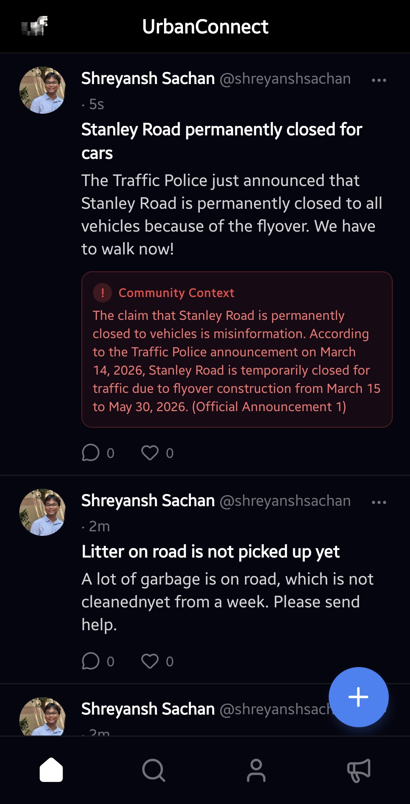
  &nbsp;&nbsp;
  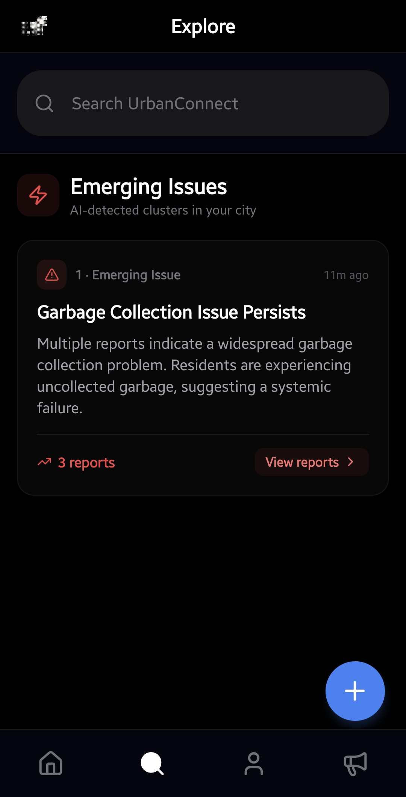
  &nbsp;&nbsp;
  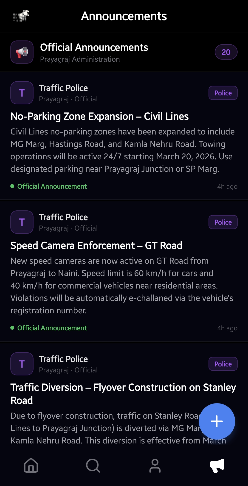
  &nbsp;&nbsp;
  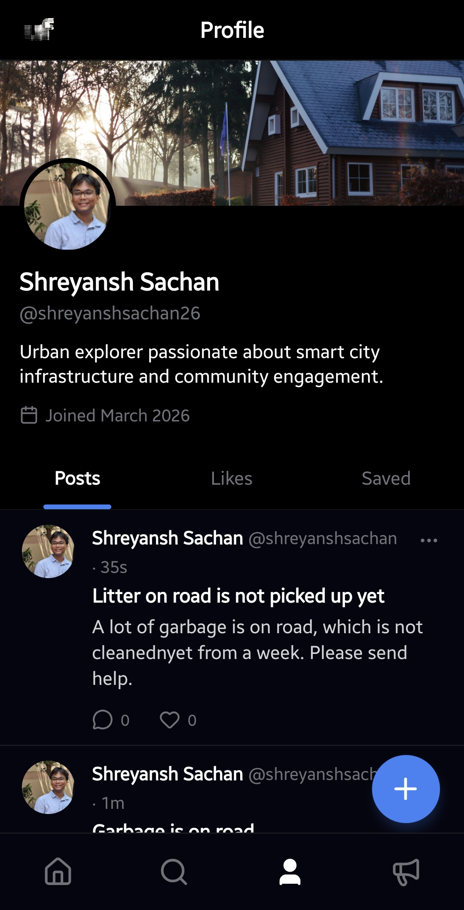
</p>
<p align="center">
  <em>Left to Right: AI Misinformation Detection with Community Context · Emerging Issue Clusters · Official Announcements · User Profile</em>
</p>

#### AI Analytics Architecture


#### Data Flow Sequence

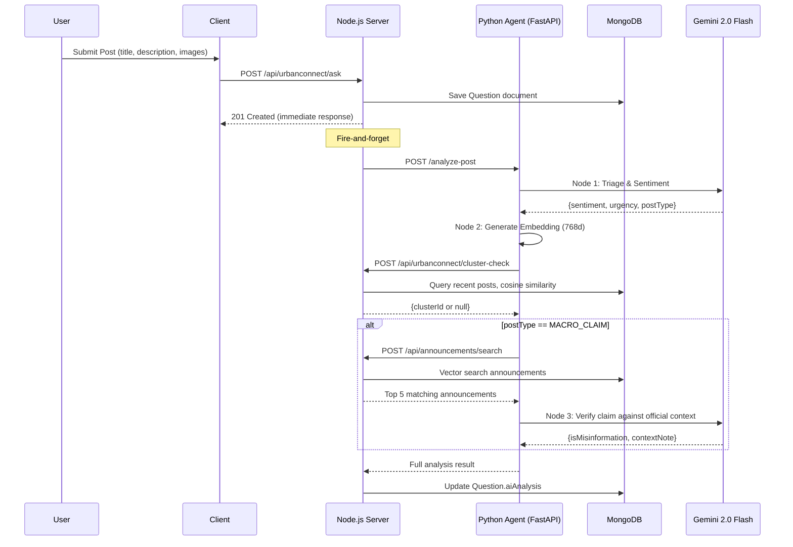
```mermaid
sequenceDiagram
    participant User
    participant Client
    participant NodeJS as Node.js Server
    participant Agent as Python Agent (FastAPI)
    participant MongoDB
    participant LLM as Gemini 2.0 Flash

    User->>Client: Submit Post (title, description, images)
    Client->>NodeJS: POST /api/urbanconnect/ask
    NodeJS->>MongoDB: Save Question document
    NodeJS-->>Client: 201 Created (immediate response)
    
    Note over NodeJS: Fire-and-forget
    NodeJS->>Agent: POST /analyze-post
    
    Agent->>LLM: Node 1: Triage & Sentiment
    LLM-->>Agent: {sentiment, urgency, postType}
    
    Agent->>Agent: Node 2: Generate Embedding (768d)
    Agent->>NodeJS: POST /api/urbanconnect/cluster-check
    NodeJS->>MongoDB: Query recent posts, cosine similarity
    NodeJS-->>Agent: {clusterId or null}
    
    alt postType == MACRO_CLAIM
        Agent->>NodeJS: POST /api/announcements/search
        NodeJS->>MongoDB: Vector search announcements
        NodeJS-->>Agent: Top 5 matching announcements
        Agent->>LLM: Node 3: Verify claim against official context
        LLM-->>Agent: {isMisinformation, contextNote}
    end
    
    Agent-->>NodeJS: Full analysis result
    NodeJS->>MongoDB: Update Question.aiAnalysis
```

### Technical Deep-Dive

| System | Technology | Implementation |
|:---|:---|:---|
| **Multimodal Triage** | Gemini 2.0 Flash (Structured) | Analyzes text + up to 3 images to classify posts into `CIVIC_REPORT` (witnessed issues), `POLICY_RUMOR` (fact-check required), or `GENERAL`. Assigns emotional [sentiment](cci:1://file:///Users/aryangupta/Documents/Projects/dev/agents/brain/civic_analysis_agent.py:59:0-124:9) (ALARMING to POSITIVE) and `urgency` (LOW to CRITICAL) for authority routing. |
| **Emerging Issue Clustering** | Cosine Similarity (Firestore/Mongo) | Uses a **12-hour sliding window** to compare new embeddings against recent posts. If similarity reaches **≥ 0.75** and a group of **3+ posts** forms, the system automatically creates an AI-generated headline and summary to alert city officials of an emerging cluster. |
| **Hybrid RAG Fact-Check** | Vector Search + Tavily API | Exclusive to `POLICY_RUMOR` posts. This node retrieves top-5 official announcements from the municipal database. If local data is insufficient (<2 results), it triggers a **Tavily Web Search** fallback to verify the rumor against live news sources before flagging misinformation. |
| **Semantic Vectorization** | Gemini Embedding-001 (768-dim) | Generates dense 768-dimensional embeddings by concatenating `title + description`. This unified vector is utilized for both duplicate detection within the clustering engine and context-matching in the RAG pipeline. |
| **Social Integrity Layer** | Server-side Vote Model + Redis | Implements strict vote integrity via a [QuestionVote](cci:1://file:///Users/aryangupta/Documents/Projects/dev/server/src/controllers/urbanconnect.controller.js:454:0-504:2) model (1:1 constraint). Voting is handled via an atomic toggle system (Add/Update/Delete). High-concurrency feeds are optimized via **geohash-based Redis caching** (`urbanconnect:questions:*`) with automated invalidation. |
| **Authority Handover** | TaggedAuthority Schema | Posts can be tagged with specific `Administration` IDs. The system logic routes `CIVIC_REPORT` data directly to these tagged departments, while `ALARMING` or `CRITICAL` sentiment triggers escalated visibility in the admin command panel. |
---

### 7. Civic Intelligence Dashboard — AI Decision Support for Local Leaders *(Category 3)*

The Civic Intelligence Dashboard is UrbanFlow's dedicated answer to **Category 3** — an AI-native leadership layer that transforms fragmented civic data into structured, actionable intelligence.

<p align="center">
  
</p>
<p align="center">
  <em>Civic Intelligence Dashboard — Full-spectrum social media intelligence with misinformation detection, issue clustering, and per-post AI analysis</em>
</p>

#### Key Capabilities

| Capability | Description | AI Technology |
|---|---|---|
| **Public Trust Index** | Real-time composite: resolution rate + citizen sentiment + scheme progress. Visualized per ward and time period. | Aggregated multi-stream analytics |

---

## Technical Architecture

```
┌──────────────────────────────────────────────────────────────────────┐
│                        CLIENT LAYER                                  │
│  React Native Mobile App  │  React.js Web Dashboard  │  Staff PWA    │
└──────────────┬────────────────────────────┬──────────────────────────┘
               │ HTTPS / WebSocket           │ Firebase RTDB
┌──────────────▼───────────────────────────────────────────────────────┐
│                    API GATEWAY (Node.js / Express)                    │
│  Auth Middleware (Auth0 JWT)  │  Rate Limiting (Redis)               │
│  REST Endpoints  │  Event Emitters  │  Webhook Receivers             │
└─────────┬──────────────────────────────┬─────────────────────────────┘
          │ HTTP / gRPC                   │ Message Queue (RabbitMQ)
┌─────────▼────────────────────────────────────────────────────────────┐
│               AI INFERENCE ENGINE (Python / FastAPI)                  │
│  Multi-Agent Orchestration (LangChain)                               │
│  ┌───────────┐ ┌───────────┐ ┌───────────┐ ┌───────────────────┐   │
│  │ Safety    │ │ Infra     │ │ Jobs      │ │ Leadership /      │   │
│  │ Agent     │ │ Agent     │ │ Agent     │ │ Sentiment Agent   │   │
│  └───────────┘ └───────────┘ └───────────┘ └───────────────────┘   │
│  Vision AI │ NLP Pipeline │ Embeddings │ Whisper Transcription      │
└─────────┬────────────────────────────────────────────────────────────┘
          │
┌─────────▼────────────────────────────────────────────────────────────┐
│                        DATA LAYER                                     │
│  MongoDB (primary)  │  Firebase RTDB (real-time)  │  Redis (cache)    │
│  Firestore (spatial)│  Cloudinary (media CDN)     │                   │
└──────────────────────────────────────────────────────────────────────┘
```

---

## Complete Technology Stack

### Frontend Technologies

| Technology | Version / Spec | Role in UrbanFlow | Why This Choice |
|---|---|---|---|
| **React Native** | 0.76+ with Expo SDK 52 | Citizen mobile app (Android + iOS) | Single codebase, native performance, background task execution, GPS APIs |
| **NativeWind** | v4 (Tailwind for RN) | Mobile UI styling | Utility-first styling with responsive breakpoints in React Native |
| **React.js** | 18+ (Vite bundler) | Admin web dashboard | Fast HMR, tree-shaking, data-dense table/chart rendering |
| **Tailwind CSS** | v3 | Web dashboard styling | Rapid UI prototyping with consistent design tokens |
| **Google Maps Platform** | Maps SDK, Directions API | Safe route rendering, geocoding | Industry-standard mapping with real-time traffic data |
| **Expo Router** | v3 | File-based routing for mobile | Type-safe navigation, deep linking, screen preloading |

### Backend & API Technologies

| Technology | Version / Spec | Role in UrbanFlow | Why This Choice |
|---|---|---|---|
| **Node.js** | 20 LTS | Primary API gateway | Non-blocking I/O for concurrent civic requests |
| **Express.js** | v4 | REST framework | Lightweight middleware chain, extensive ecosystem |
| **FastAPI** | 0.100+ (Python) | AI inference engine | Async Python, auto-docs, native Pydantic validation, sub-200ms response |
| **Auth0** | JWT-based | Multi-platform authentication | Managed identity with social login, MFA, role-based access |
| **Firebase Auth** | — | Mobile-native auth | Seamless React Native integration, anonymous-to-permanent upgrade |
| **RabbitMQ** | 3.12+ | Async messaging | Reliable task queues for background AI processing, notification dispatch |

### AI & Machine Learning Stack

| Technology | Version / Spec | Role in UrbanFlow | Why This Choice |
|---|---|---|---|
| **LangChain** | Python SDK | Multi-agent orchestration | ReAct prompting, tool-use pipelines, structured agent networks |
| **Google Vertex AI** | Gemini 2.0 Flash | Vision-language analysis, complaint classification | Multimodal understanding, low-latency inference |
| **Google Earth Engine** | JS + Python APIs | Satellite environmental monitoring | Petabyte-scale satellite catalog, server-side computation |

### Database & Storage Layer

| Technology | Spec | Role in UrbanFlow | Why This Choice |
|---|---|---|---|
| **MongoDB** | 7.0+ with Atlas Vector Search | Primary document store, vector search | Flexible schema for nested civic documents, native vector indexing |
| **Firebase Realtime Database** | — | Sub-100ms SOS, live tracking, chat | WebSocket-based, zero-latency for life-critical signals |
| **Firestore** | — | Geohash-indexed spatial records | Composite index support, geohash `IN` queries for O(1) proximity |
| **Redis** | 7.0+ | Cache, rate limiting, sessions | In-memory speed for spatial query caching and API throttling |
| **Cloudinary** | — | Media CDN | Complaint images, profile photos, resolution proof with auto-optimization |

###  Infrastructure & DevOps Architectural Specs

| Component | Technology | Implementation Deep-Dive |
|:---|:---|:---|
| **Identity & Access** | **Auth0** | Implements **JWT-based OIDC** for unified mobile/web sessions. The backend uses `express-oauth2-jwt-bearer` to enforce strict audience/issuer validation, securing all SOS and user-sensitive endpoints. |
| **Asset Pipeline** | **Cloudinary** | Acts as the **Global CDN** for municipal evidence and NGO donations. Uses `upload_stream` for direct binary-to-cloud piping, eliminating local disk footprint and ensuring sub-second image availability. |
| **Persistence Layer** | **MongoDB Atlas** | A distributed document database handling the system's **Social Graph** and **Closen-Loop Workflows**. Optimized with compound indexes on `geohash` and `status` for rapid municipal lookup. |
| **Distributed Caching** | **Redis Labs** | Transparent caching layer for high-concurrency feeds (e.g., `urbanconnect:questions:*`). Uses a **60-second TTL** to balance real-time freshness with sub-100ms response benchmarks. |
| **Async Messaging** | **CloudAMQP** | Provides a **RabbitMQ** broker that decouples the Express API from heavy Python AI processing. Manages the lifecycle of `CIVIC_REPORT` and `SKILL_GAP` tasks via robust message queuing. |
| **Real-time Sync** | **Firebase** | Orchestrates **Real-Time Database (RTDB)** listeners for high-frequency coordinate updates (SOS movement) and **FCM** for critical, out-of-band emergency push notifications. |
| **Spatial Indexing** | **ngeohash** | Multi-precision geohashing (**Precision-4** for regional NGO discovery, **Precision-6** for local threat zones). Enables efficient proximity queries without the overhead of heavy geospatial engines. |
| **Mobile DevOps** | **Expo EAS** | Managed **CI/CD pipeline** for Android/iOS. Leverages **Over-The-Air (OTA)** updates to push critical security logic or safety bugfixes to devices without requiring a full App Store review cycle. |
| **Communication** | **Nodemailer** | Configured with an authenticated **SMTP gateway** to trigger transactional automation, such as NGO approval notices and citizen "Proof-of-Resolution" email reports. |

---

### System Architecture & DevOps Flow
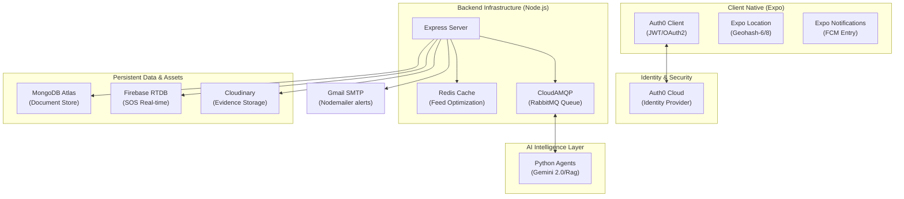
```mermaid
graph TD
    subgraph CLIENT[" Client Native (Expo)"]
        A[" Auth0 Client\n(JWT/OAuth2)"]
        B[" Expo Location\n(Geohash-6/8)"]
        C[" Expo Notifications\n(FCM Entry)"]
    end

    subgraph AUTH[" Identity & Security"]
        A <--> D[" Auth0 Cloud\n(Identity Provider)"]
    end

    subgraph BACKEND[" Backend Infrastructure (Node.js)"]
        E[" Express Server"]
        F[" Redis Cache\n(Feed Optimization)"]
        G[" CloudAMQP\n(RabbitMQ Queue)"]
    end

    subgraph STORAGE[" Persistent Data & Assets"]
        H[" MongoDB Atlas\n(Document Store)"]
        I[" Firebase RTDB\n(SOS Real-time)"]
        J[" Cloudinary\n(Evidence Storage)"]
    end

    subgraph AGENTS[" AI Intelligence Layer"]
        G <--> K[" Python Agents\n(Gemini 2.0/Rag)"]
    end

    E --> F
    E --> G
    E --> H
    E --> I
    E --> J
    E --> L[" Gmail SMTP\n(Nodemailer alerts)"]

```

## AI Pipeline Deep-Dives

### Multi-Agent Orchestration (LangGraph)

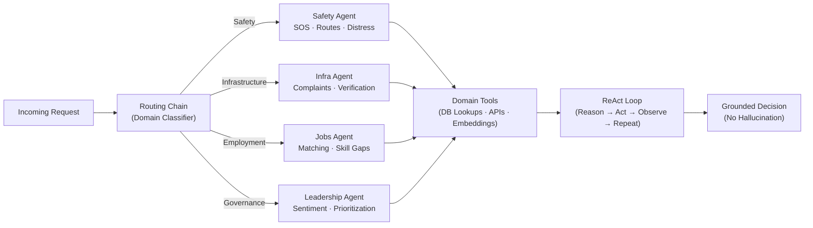
```mermaid
graph LR
    REQ["Incoming Request"] --> RC["Routing Chain<br/>(Domain Classifier)"]
    RC -->|Safety| SA["Safety Agent<br/>SOS · Routes · Distress"]
    RC -->|Infrastructure| IA["Infra Agent<br/>Complaints · Verification"]
    RC -->|Employment| JA["Jobs Agent<br/>Matching · Skill Gaps"]
    RC -->|Governance| LA["Leadership Agent<br/>Sentiment · Prioritization"]
    
    SA --> TOOLS["Domain Tools<br/>(DB Lookups · APIs · Embeddings)"]
    IA --> TOOLS
    JA --> TOOLS
    LA --> TOOLS
    
    TOOLS --> REACT["ReAct Loop<br/>(Reason → Act → Observe → Repeat)"]
    REACT --> OUT["Grounded Decision<br/>(No Hallucination)"]
```

UrbanFlow uses LangChain to construct a network of **specialized AI agents**, each with access to domain-specific tools. Agents use **ReAct (Reasoning + Acting)** prompting patterns, enabling them to iteratively query tools, reason over intermediate outputs, and arrive at grounded decisions rather than hallucinated responses.

### Vector Embedding Architecture

All semantic matching — job-worker matching, scheme-worker matching, and complaint deduplication — is powered by **`text-embedding-3-large`** embeddings stored as Firestore Vector fields. Similarity is computed server-side using **cosine similarity in NumPy**, achieving sub-200ms inference times without a dedicated vector database.

### Geohash Spatial Indexing

| Precision | Cell Size | Use Case |
|---|---|---|
| **Geohash-4** | ~39 km² | Broad neighborhood lookup for initial candidate retrieval |
| **Geohash-6** | ~1.2 km² | Precise proximity matching for job/alert discovery |

Single-query retrieval via Firestore's `IN` operator over the **9-cell geohash neighborhood** achieves **O(1) spatial lookup complexity** without geospatial indexes.

### Real-Time Firebase Architecture

```
fireAlerts/{geohash}/{alertId}              → Geo-indexed SOS records
staff/fire/{geohash}/{truckId}/coords       → Live truck GPS coordinates
jobs/rooms/{chatRoomId}/members/{userId}    → Per-room participant tracking
userActiveAlerts/{userId}                    → Per-user alert state (deduplication)
```

All RTDB listeners are attached at the component level and cleaned up on unmount, preventing memory leaks in long-running mobile sessions.

---

## Repository Structure

```
UrbanFlow/
├── client-native/          # React Native (Expo) — Citizen mobile app
│   ├── app/                # File-based routing (Expo Router)
│   ├── components/         # Reusable UI components
│   └── services/           # API clients, Firebase configs
├── client/                 # React.js (Vite) — Admin web dashboard
│   ├── src/pages/          # Route-level page components
│   └── src/components/     # Dashboard widgets, charts, maps
├── server/                 # Node.js (Express) — API gateway
│   ├── controllers/        # Business logic handlers
│   ├── models/             # MongoDB schemas (Mongoose)
│   └── routes/             # REST endpoint definitions
├── agents/                 # Python (FastAPI) — AI inference engine
│   ├── pipelines/          # Multi-agent orchestration configs
│   └── models/             # ML model wrappers
└── ReadmeMedia/            # Screenshots and documentation assets
```

---

<p align="center">
  <strong>UrbanFlow — Every citizen action intelligently processed. Every civic decision AI-informed.</strong><br>
  <em>Made with Love ❤️ by Team UrbanFlow</em>
</p>
