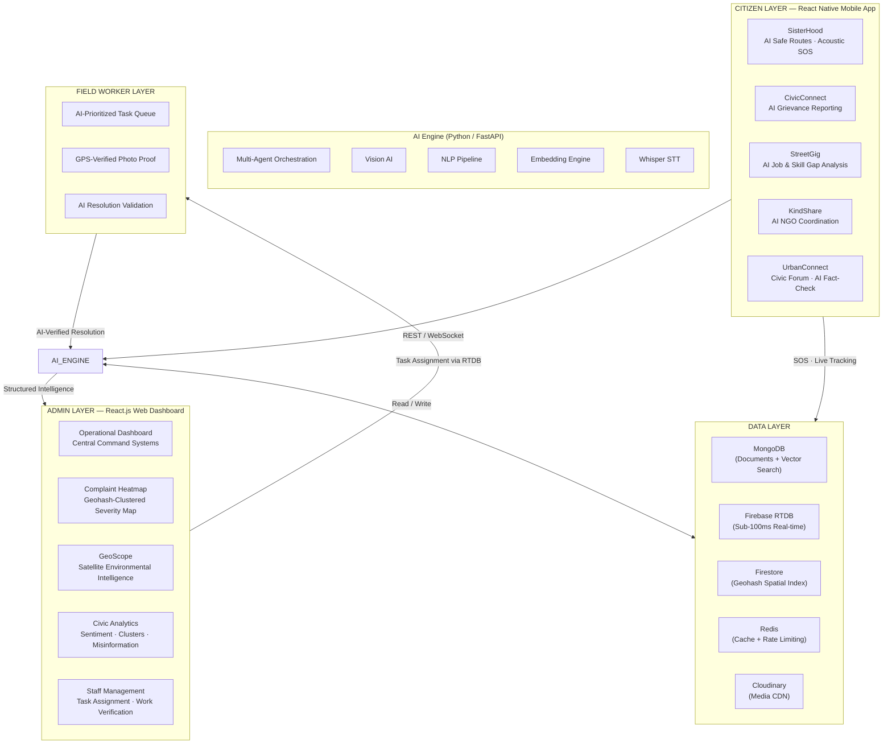
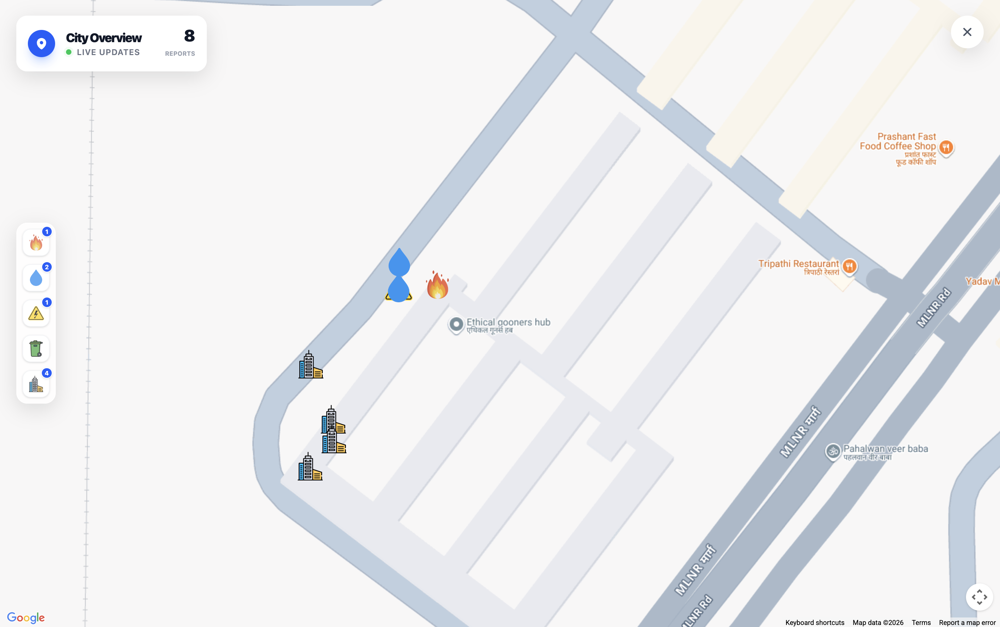
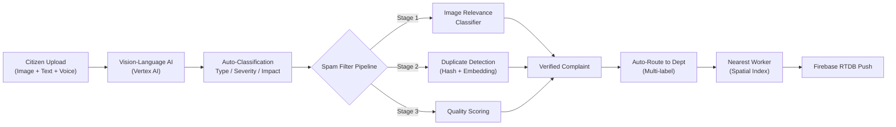
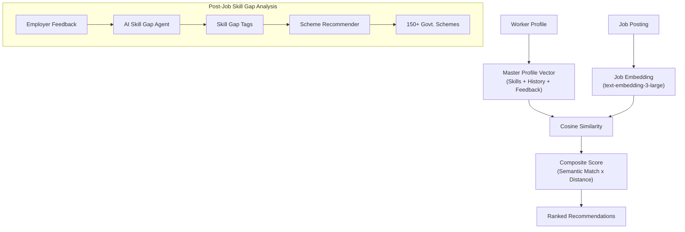
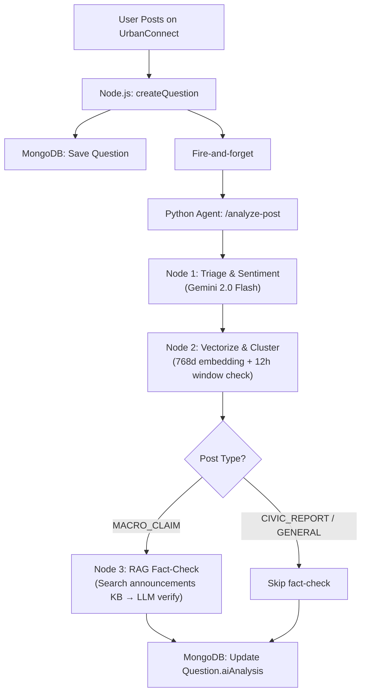
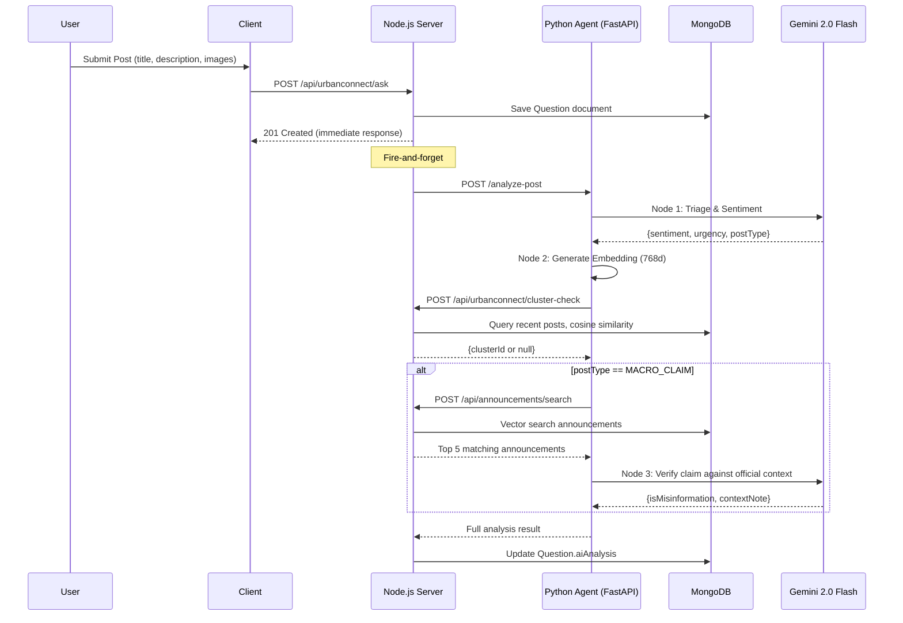
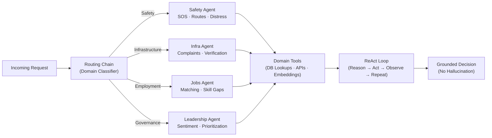

<p align="center">
  
</p>

<h1 align="center">UrbanFlow</h1>
<h3 align="center">The Integrated AI-Powered Civic Management Suite</h3>

<p align="center">
  <strong>SANKALP Hackathon 2026</strong><br>
  Built by <strong>Shreyansh Sachan</strong> · <strong>Ishwar</strong> · <strong>Aryan Gupta</strong> · <strong>Arushi Nayak</strong>
</p>

<p align="center">
  
  
  
  
</p>

---

> **UrbanFlow** is a production-grade, AI-first civic operating system that transforms the relationship between citizens, municipal administration, local leaders, and field operations. It deploys a synchronized, three-tier ecosystem driven by **Large Language Models**, **multi-agent AI orchestration**, **real-time streaming**, **computer vision**, **satellite analytics**, and **geospatial intelligence**.

---

## System Workflow — End-to-End Architecture



---

## Problem Statements Addressed

### Urban Civic Services
Citizens lack unified, intelligent channels for reporting grievances, accessing safe navigation, finding employment, and coordinating community resources. Municipal systems operate in silos with no AI layer to triage, route, or verify work — resulting in slow response, low transparency, and poor outcomes.

### AI for Local Leadership, Decision Intelligence & Public Trust
Local leaders operate at the front line of service delivery, yet grassroots governance processes remain fragmented and unstructured. UrbanFlow's **Civic Intelligence Dashboard** directly addresses this with:

- AI-powered structuring of citizen issues from voice, text, image, and social media inputs
- Intelligent issue prioritization using ML-based urgency, impact, and recurrence scoring
- AI-validated geo-tagged, time-stamped verification of field work completion
- NLP pipelines for social media sentiment and misinformation detection
- AI-assisted generation of verified public communications
- Real-time dashboards exposing execution status and citizen trust indicators

---

## Application Walkthrough

### Citizen Mobile Application

The mobile interface is designed for accessibility and rapid response, enabling citizens to interact with AI-powered civic tools from a single unified surface.

<p align="center">
  
  &nbsp;&nbsp;
  
</p>
<p align="center">
  <em>Left: Dashboard Home with feature cards (SisterHood, CivicConnect, StreetGig, KindShare, UrbanConnect) · Right: Real-time notification feed showing grievance resolution updates</em>
</p>

---

### Web Administration Panel

The centralized command hub where municipal authorities leverage AI-generated summaries, anomaly alerts, live maps, and satellite data to orchestrate city operations.

<p align="center">
  
</p>
<p align="center">
  <em>Operational Dashboard — Central Command Systems with live status indicators and Departmental Operations overview</em>
</p>

<p align="center">
  
  &nbsp;
  
</p>
<p align="center">
  <em>Live Complaint Heatmap — Geohash-clustered grievances with AI-determined severity, filterable by department and date range</em>
</p>

---

### GeoScope — Satellite Intelligence Panel

<p align="center">
  
  &nbsp;
  
</p>
<p align="center">
  <em>Left: Environmental Monitoring module selector (6 analysis types powered by Google Earth Engine) · Right: Flood Analysis Report using Sentinel-1 SAR data with radar baseline vs. detected flood extent</em>
</p>

---

### Civic Intelligence Dashboard — AI Leadership Module

A dedicated AI decision-support surface for local leaders and administrators, surfacing ground realities from both citizen-reported data and civic social media signals.

<p align="center">
  
</p>
<p align="center">
  <em>Civic Analytics — Real-time sentiment distribution, emerging issue clusters, misinformation detection with AI-generated context notes, and a per-post analysis table</em>
</p>

---

### Staff & Field Worker Management

<p align="center">
  
  &nbsp;
  
  &nbsp;
  
</p>
<p align="center">
  <em>Left: AI-triaged complaint queue (Needs Action) · Center: Staff assignment panel with proximity ranking and AI-generated task details · Right: Resolved complaints with AI verification</em>
</p>

<p align="center">
  
</p>
<p align="center">
  <em>Staff Work Overview — Track assigned, in-progress, and completed tasks across all field workers</em>
</p>

---

### Women Safety — Police Command Panel

<p align="center">
  
</p>
<p align="center">
  <em>Live SOS Command — Active distress signals on map, Voice SOS recordings with AI-generated summaries, distress pattern detection, and recommended emergency actions</em>
</p>

---

## Detailed Feature Breakdown

### 1. SisterHood — AI-Powered Personal Safety & Emergency Response

SisterHood is a real-time safety platform built on continuous AI inference and decentralized emergency coordination, primarily targeting women navigating urban environments.

<p align="center">
  
  &nbsp;&nbsp;
  
  &nbsp;&nbsp;
  
</p>
<p align="center">
  <em>Left: AI safe route with risk heatmap · Center: SOS triggered — Securing Perimeter with nearby alert broadcast · Right: SOS deactivation with false alarm feedback loop</em>
</p>

#### Technical Deep-Dive

| Component | Technology | Implementation |
|---|---|---|
| **Safe Route Engine** | Modified Dijkstra's, Google Maps Platform | Multi-factor safety index: historical incident heatmaps, crowd density, street lighting from satellite imagery, time-of-day risk modifiers. Optimizes for safety-weighted cost, not pure distance. |
| **Acoustic Distress Monitor** | TensorFlow Lite (on-device) | 16kHz mic input, 3-second sliding buffer, confidence scoring every second. Trained on labeled distress vocalizations. Zero-interaction SOS trigger on sustained high confidence. |
| **Emergency Network** | Firebase RTDB, FCM, REST API | Parallel SOS: (1) Backend + police dispatch via RTDB, (2) geofenced push notifications to community responders, (3) live tracking for trusted contacts. |
| **Companion Matching** | Vector similarity on route segments | Matches verified users traveling same route within ±10-min departure window. Opt-in real-time coordination. |

---

### 2. CivicConnect (EcoSnap) — AI-Triaged Unified Grievance Reporting

CivicConnect replaces siloed municipal complaints with a fully AI-automated pipeline covering waste management, electricity faults, water supply, road infrastructure, and fire safety.

<p align="center">
  
  &nbsp;&nbsp;
  
  &nbsp;&nbsp;
  
  &nbsp;&nbsp;
  
</p>
<p align="center">
  <em>Left to Right: AI Grievance Report Submission · AI Photo Verification · Resolution Timeline · Field Worker Resolution Proof Upload</em>
</p>

#### AI Pipeline Architecture



#### Technical Deep-Dive

| Component | Technology | Implementation |
|---|---|---|
| **Multimodal Intake** | Vertex AI (Vision-Language), OpenAI Whisper | Joint image + text analysis extracts: issue type, severity (1–5), impact area, plain-English description. Voice to text via Whisper. |
| **Spam Filtering** | Binary classifier, perceptual hashing, NLP embeddings | 3-stage: (1) non-civic image rejection, (2) near-duplicate merging via hash + embedding similarity, (3) quality threshold enforcement. |
| **Department Routing** | Multi-label classification model | Auto-routes to sanitation / electricity / road / fire / water. Queries spatial index for nearest available worker. |
| **AI Resolution Verification** | Computer Vision, GPS metadata, timestamp validation | Before/after spatial consistency: GPS match, timestamp authenticity, visual similarity confirming issue no longer present. |

---

### 3. GeoScope — AI-Augmented Satellite Environmental Intelligence

GeoScope is a macro-scale environmental monitoring system built on **Google Earth Engine's** petabyte-scale satellite data infrastructure, extended with custom AI inference pipelines.

<p align="center">
  
  &nbsp;
  
</p>
<p align="center">
  <em>Left: 6-module environmental analysis suite · Right: Live Flood Analysis using Synthetic Aperture Radar (Sentinel-1)</em>
</p>

#### Technical Deep-Dive

| Module | Data Source | AI Processing |
|---|---|---|
| **Air Pollutants** | Sentinel-5P (SO₂, NO₂, CO, Aerosol) | Interpolated pollution density maps at 1km² resolution. AI-generated anomaly commentary. |
| **Surface Heat (UHI)** | Landsat-8 Thermal IR | Split-Window Algorithm for LST. AI segmentation identifies urban heat islands vs. baseline. |
| **Flood Watch** | Sentinel-1 SAR | Multi-temporal SAR change detection for surface water expansion. Cloud-penetrating. |
| **Deforestation** | NDVI differential analysis | Localized deforestation event detection between satellite acquisition cycles. |
| **Fire Alert** | MODIS / VIIRS active fire data | Real-time active fire detection and burn area analysis. |
| **Coastal Erosion** | Shoreline temporal analysis | Track shoreline changes and rising sea levels over time. |

---

### 4. StreetGig — AI-Matched Micro-Employment Exchange

StreetGig is a hyperlocal AI-powered labor marketplace that connects daily wage workers, freelancers, and gig workers with immediate community needs using intelligent matching and skill intelligence.

<p align="center">
  
  &nbsp;&nbsp;
  
  &nbsp;&nbsp;
  
  &nbsp;&nbsp;
  
</p>
<p align="center">
  <em>Left to Right: Worker Registration Gate · AI Job Recommendations · Job Creation with Budget Setting · AI Career Growth with Govt. Scheme Matching</em>
</p>

#### AI Matching Architecture



#### Technical Deep-Dive

| Component | Technology | Implementation |
|---|---|---|
| **Profile Vectorization** | OpenAI `text-embedding-3-large` | Skills, job history, competency signals converted to semantic vector for cosine similarity matching. |
| **Geohash Proximity** | ngeohash precision-6 (~1.2km2) | 9-cell neighborhood query via Firestore `IN` operator. O(1) spatial lookup. |
| **Skill Gap Analysis** | LangChain AI Agent | Post-job feedback processing, structured gap strings matched against 150+ govt. schemes. |
| **Employer-Side Discovery** | Background AI task | Auto-queries workers with `interestedToWork: true`, ranks by profile-job similarity. |

---

### 5. KindShare — AI-Coordinated Resource Redistribution

KindShare is a hyper-local logistics intelligence system that uses AI to eliminate resource waste and accelerate the delivery of essential goods to vulnerable populations.

<p align="center">
  
  &nbsp;&nbsp;
  
  &nbsp;&nbsp;
  
  &nbsp;&nbsp;
  
</p>
<p align="center">
  <em>Left to Right: KindShare Home · Donation Category Selector · NGO List (sorted by proximity & rating) · Available Items at NGO</em>
</p>

<p align="center">
  
</p>
<p align="center">
  <em>Web Portal — NGO Registration with auto-location detection and category preference selection</em>
</p>

#### Technical Deep-Dive

| Component | Technology | Implementation |
|---|---|---|
| **AI Donation Matching** | Classification model + matching agent | Item attribute extraction, shelf-life estimation for perishables, NGO matching by proximity + needs + capacity + reliability. |
| **Pickup Logistics** | Firebase Cloud Messaging, scheduling engine | Auto-generated pickup proposals based on donor/NGO availability. Volunteer coordination for large volumes. |
| **Impact Analytics** | Real-time aggregation | Meals provided, kg redistributed, CO₂ saved from waste diversion, NGO utilization rates. |

---

### 6. UrbanConnect — AI-Moderated Civic Social Layer

UrbanConnect is a structured civic discourse platform where residents discuss local issues, share information, and engage with each other — with AI moderation ensuring quality and safety.

<p align="center">
  
  &nbsp;&nbsp;
  
  &nbsp;&nbsp;
  
  &nbsp;&nbsp;
  
</p>
<p align="center">
  <em>Left to Right: AI Misinformation Detection with Community Context · Emerging Issue Clusters · Official Announcements · User Profile</em>
</p>

#### AI Analytics Architecture



#### Data Flow Sequence



#### Technical Deep-Dive

| Component | Technology | Implementation |
|---|---|---|
| **Triage & Sentiment** | Gemini 2.0 Flash | Classifies post type (CIVIC_REPORT, MACRO_CLAIM, GENERAL), assigns sentiment and urgency. |
| **Vectorize & Cluster** | 768d embeddings, MongoDB Vector Search | Generates embedding, checks cosine similarity against posts from last 12h to detect emerging issue clusters. |
| **RAG Fact-Check** | Vector search + LLM verification | For MACRO_CLAIM posts: searches official announcements KB, LLM verifies claim against retrieved context. |
| **Voting Integrity** | Server-side `Vote` model (userId + targetId + targetType) | One vote per user per item, enforced server-side. Toggle on re-vote. Real-time count aggregation. |

---

### 7. Civic Intelligence Dashboard — AI Decision Support for Local Leaders *(Category 3)*

The Civic Intelligence Dashboard is UrbanFlow's dedicated answer to **Category 3** — an AI-native leadership layer that transforms fragmented civic data into structured, actionable intelligence.

<p align="center">
  
</p>
<p align="center">
  <em>Civic Intelligence Dashboard — Full-spectrum social media intelligence with misinformation detection, issue clustering, and per-post AI analysis</em>
</p>

#### Key Capabilities

| Capability | Description | AI Technology |
|---|---|---|
| **Multi-Modal Issue Intake** | Voice (Whisper), text (NLP), image (Vision AI) → uniform schema: location, category, severity, affected population, recurrence | OpenAI Whisper, Vertex AI, NLP Pipeline |
| **ML Prioritization Engine** | Composite score: urgency × impact radius × recurrence frequency × resource availability | Multi-factor ML model on historical civic data |
| **AI Field Verification** | GPS cross-validation, timestamp authenticity check, computer vision content validation, confidence scoring | Computer Vision, metadata forensics |
| **Sentiment Pipeline** | Continuous social media analysis: sentiment classification, LDA topic modeling, misinformation detection | NLP (LDA, BERT-class models) |
| **AI Communication Generator** | Drafts verified public announcements from live data. Tone selector: formal / empathetic / informational. Inline data citations. | LLM with system data grounding |
| **Public Trust Index** | Real-time composite: resolution rate + citizen sentiment + scheme progress. Visualized per ward and time period. | Aggregated multi-stream analytics |

---

## Technical Architecture

```
┌──────────────────────────────────────────────────────────────────────┐
│                        CLIENT LAYER                                  │
│  React Native Mobile App  │  React.js Web Dashboard  │  Staff PWA    │
└──────────────┬────────────────────────────┬──────────────────────────┘
               │ HTTPS / WebSocket           │ Firebase RTDB
┌──────────────▼───────────────────────────────────────────────────────┐
│                    API GATEWAY (Node.js / Express)                    │
│  Auth Middleware (Auth0 JWT)  │  Rate Limiting (Redis)               │
│  REST Endpoints  │  Event Emitters  │  Webhook Receivers             │
└─────────┬──────────────────────────────┬─────────────────────────────┘
          │ HTTP / gRPC                   │ Message Queue (RabbitMQ)
┌─────────▼────────────────────────────────────────────────────────────┐
│               AI INFERENCE ENGINE (Python / FastAPI)                  │
│  Multi-Agent Orchestration (LangChain)                               │
│  ┌───────────┐ ┌───────────┐ ┌───────────┐ ┌───────────────────┐   │
│  │ Safety    │ │ Infra     │ │ Jobs      │ │ Leadership /      │   │
│  │ Agent     │ │ Agent     │ │ Agent     │ │ Sentiment Agent   │   │
│  └───────────┘ └───────────┘ └───────────┘ └───────────────────┘   │
│  Vision AI │ NLP Pipeline │ Embeddings │ Whisper Transcription      │
└─────────┬────────────────────────────────────────────────────────────┘
          │
┌─────────▼────────────────────────────────────────────────────────────┐
│                        DATA LAYER                                     │
│  MongoDB (primary)  │  Firebase RTDB (real-time)  │  Redis (cache)    │
│  Firestore (spatial)│  Cloudinary (media CDN)     │                   │
└──────────────────────────────────────────────────────────────────────┘
```

---

## Complete Technology Stack

### Frontend Technologies

| Technology | Version / Spec | Role in UrbanFlow | Why This Choice |
|---|---|---|---|
| **React Native** | 0.76+ with Expo SDK 52 | Citizen mobile app (Android + iOS) | Single codebase, native performance, background task execution, GPS APIs |
| **NativeWind** | v4 (Tailwind for RN) | Mobile UI styling | Utility-first styling with responsive breakpoints in React Native |
| **React.js** | 18+ (Vite bundler) | Admin web dashboard | Fast HMR, tree-shaking, data-dense table/chart rendering |
| **Tailwind CSS** | v3 | Web dashboard styling | Rapid UI prototyping with consistent design tokens |
| **Leaflet** | 1.9+ | Complaint heatmaps, geospatial overlays | Open-source, lightweight map rendering with custom tile layers |
| **Google Maps Platform** | Maps SDK, Directions API | Safe route rendering, geocoding | Industry-standard mapping with real-time traffic data |
| **Expo Router** | v3 | File-based routing for mobile | Type-safe navigation, deep linking, screen preloading |

### Backend & API Technologies

| Technology | Version / Spec | Role in UrbanFlow | Why This Choice |
|---|---|---|---|
| **Node.js** | 20 LTS | Primary API gateway | Non-blocking I/O for concurrent civic requests |
| **Express.js** | v4 | REST framework | Lightweight middleware chain, extensive ecosystem |
| **FastAPI** | 0.100+ (Python) | AI inference engine | Async Python, auto-docs, native Pydantic validation, sub-200ms response |
| **Auth0** | JWT-based | Multi-platform authentication | Managed identity with social login, MFA, role-based access |
| **Firebase Auth** | — | Mobile-native auth | Seamless React Native integration, anonymous-to-permanent upgrade |
| **RabbitMQ** | 3.12+ | Async messaging | Reliable task queues for background AI processing, notification dispatch |

### AI & Machine Learning Stack

| Technology | Version / Spec | Role in UrbanFlow | Why This Choice |
|---|---|---|---|
| **LangChain** | Python SDK | Multi-agent orchestration | ReAct prompting, tool-use pipelines, structured agent networks |
| **Google Vertex AI** | Gemini 2.0 Flash | Vision-language analysis, complaint classification | Multimodal understanding, low-latency inference |
| **OpenAI GPT-4o** | API | Skill gap inference, NL generation | State-of-the-art reasoning for complex textual analysis |
| **OpenAI Whisper** | API | Voice grievance transcription | Multilingual speech-to-text, robust to ambient noise |
| **OpenAI `text-embedding-3-large`** | 3072d vectors | Worker/job/complaint vectorization | High-dimensional semantic representation for cosine similarity |
| **TensorFlow Lite** | On-device | Acoustic distress classification | Battery-efficient on-device inference, no network dependency for SOS |
| **Google Earth Engine** | JS + Python APIs | Satellite environmental monitoring | Petabyte-scale satellite catalog, server-side computation |

### Database & Storage Layer

| Technology | Spec | Role in UrbanFlow | Why This Choice |
|---|---|---|---|
| **MongoDB** | 7.0+ with Atlas Vector Search | Primary document store, vector search | Flexible schema for nested civic documents, native vector indexing |
| **Firebase Realtime Database** | — | Sub-100ms SOS, live tracking, chat | WebSocket-based, zero-latency for life-critical signals |
| **Firestore** | — | Geohash-indexed spatial records | Composite index support, geohash `IN` queries for O(1) proximity |
| **Redis** | 7.0+ | Cache, rate limiting, sessions | In-memory speed for spatial query caching and API throttling |
| **Cloudinary** | — | Media CDN | Complaint images, profile photos, resolution proof with auto-optimization |

### Infrastructure & DevOps

| Technology | Role |
|---|---|
| **Firebase Cloud Messaging (FCM)** | Push notifications: SOS broadcasts, status updates, dispatch alerts |
| **ngeohash** | Precision-4 (~39km²) and precision-6 (~1.2km²) spatial indexing |
| **Google Maps Geocoding API** | Address ↔ coordinate resolution |
| **Expo EAS** | Over-the-air mobile updates, CI/CD builds |

---

## AI Pipeline Deep-Dives

### Multi-Agent Orchestration (LangChain)



UrbanFlow uses LangChain to construct a network of **specialized AI agents**, each with access to domain-specific tools. Agents use **ReAct (Reasoning + Acting)** prompting patterns, enabling them to iteratively query tools, reason over intermediate outputs, and arrive at grounded decisions rather than hallucinated responses.

### Vector Embedding Architecture

All semantic matching — job-worker matching, scheme-worker matching, and complaint deduplication — is powered by **`text-embedding-3-large`** embeddings stored as Firestore Vector fields. Similarity is computed server-side using **cosine similarity in NumPy**, achieving sub-200ms inference times without a dedicated vector database.

### Geohash Spatial Indexing

| Precision | Cell Size | Use Case |
|---|---|---|
| **Geohash-4** | ~39 km² | Broad neighborhood lookup for initial candidate retrieval |
| **Geohash-6** | ~1.2 km² | Precise proximity matching for job/alert discovery |

Single-query retrieval via Firestore's `IN` operator over the **9-cell geohash neighborhood** achieves **O(1) spatial lookup complexity** without geospatial indexes.

### Real-Time Firebase Architecture

```
fireAlerts/{geohash}/{alertId}              → Geo-indexed SOS records
staff/fire/{geohash}/{truckId}/coords       → Live truck GPS coordinates
jobs/rooms/{chatRoomId}/members/{userId}    → Per-room participant tracking
userActiveAlerts/{userId}                    → Per-user alert state (deduplication)
```

All RTDB listeners are attached at the component level and cleaned up on unmount, preventing memory leaks in long-running mobile sessions.

---

## Repository Structure

```
UrbanFlow/
├── client-native/          # React Native (Expo) — Citizen mobile app
│   ├── app/                # File-based routing (Expo Router)
│   ├── components/         # Reusable UI components
│   └── services/           # API clients, Firebase configs
├── client/                 # React.js (Vite) — Admin web dashboard
│   ├── src/pages/          # Route-level page components
│   └── src/components/     # Dashboard widgets, charts, maps
├── server/                 # Node.js (Express) — API gateway
│   ├── controllers/        # Business logic handlers
│   ├── models/             # MongoDB schemas (Mongoose)
│   └── routes/             # REST endpoint definitions
├── agents/                 # Python (FastAPI) — AI inference engine
│   ├── pipelines/          # Multi-agent orchestration configs
│   └── models/             # ML model wrappers
└── ReadmeMedia/            # Screenshots and documentation assets
```

---

<p align="center">
  <strong>UrbanFlow — Every citizen action intelligently processed. Every civic decision AI-informed.</strong><br>
  <em>Built for the city of tomorrow. Shipped at SANKALP 2026.</em>
</p>
